--- 
title: "Technical Guide for Estimating Building Rooftop Solar Potential in a City"
author: "Einav Grinberg"
date: "`r Sys.Date()`"
site: bookdown::bookdown_site
documentclass: book
bibliography: [book.bib, packages.bib]
url: https://bookdown.org/einavg7/sp_technical_guide/
# cover-image: path to the social sharing image like images/cover.jpg
description: |
  A technical guide for mapping rooftop solar potential in a city using open source data and software.
link-citations: yes
github-repo: Einavg7/Solar-Potential-Technical-Guide
---
```{r include=FALSE}
# automatically create a bib database for R packages
knitr::write_bib(c(
  .packages(), 'bookdown', 'knitr', 'rmarkdown'
), 'packages.bib')
#options(knitr.duplicate.label = "allow")
library(knitr)
library(dplyr)
library(sf)
library(spatstat)
library(raster)
library(units)
library(plotrix)  
library(sfsmisc)
library(mapview)
library(rgdal)
```

# Introduction {-}
```{r img1, out.width='80%', fig.align='center', echo=FALSE}

```
In 1990, cities accounted for 45% of global final energy use, but by the end of 2020, this share had risen to approximately 75% and cities release a similar share of global energy-related CO₂ emissions. Today, most of the world's energy supply is generated from fossil fuels, coal, oil, and natural gas. Fossil fuels are non-renewable sources of energy, and their use has a negative impact on the world’s economy, ecology, and climate ^[REN21 (2021), Renewables in Cities 2021 Global Status Report (Paris: REN21 Secretariat)]. Therefore, the use and need for renewable energy resources such as solar energy, is increasing and becoming more possible due to the rapid development of relevant technologies and scientific knowledge. ^[Voivontas, D., Assimacopoulos, D., Mourelatos, A., & Corominas, J. (1998). Evaluation of Renewable Energy potential using a GIS decision support system. Renewable Energy, 13(3), 333-344. doi: 10.1016/s0960-1481(98)00006-8] ^[Uyan, M. (2013). GIS-based solar farms site selection using analytic hierarchy process (AHP) in Karapinar region, Konya/Turkey. Renewable And Sustainable Energy Reviews, 28, 11-17. doi: 10.1016/j.rser.2013.07.042] ^[Li, C. (2018). GIS for Urban Energy Analysis. Comprehensive Geographic Information Systems, 187-195. doi: 10.1016/b978-0-12-409548-9.09652-4] ^[Kirby Calvert, J.M. Pearce, W. E. Mabee. Toward renewable energy geo-information infrastructures: Applications of GIScience and remote sensing that build institutional capacity. Renewable and Sustainable Energy Reviews, Elsevier, 2013, 18, pp.416-429. 10.1016/j.rser.2012.10.024. hal-02120459] ^[Resch, B., Sagl, G., Törnros, T., Bachmaier, A., Eggers, J., & Herkel, S. et al. (2014). GIS-Based Planning and Modeling for Renewable Energy: Challenges and Future Research Avenues. ISPRS International Journal Of Geo-Information, 3(2), 662-692. doi: 10.3390/ijgi3020662]

**This guide introduces a step by step approach to map building rooftop solar potential in a city.** 
The guide is intended for the use of city planners, infrastructure managers, and city data analysts. With the outputs of this guide, decision makers can make informed decisions to advance the implementation of sustainable and renewable energy solutions in their city.

## Motivation behind the guide {-}
```{r img2, out.width='50%', fig.align='center', echo=FALSE}
knitr::include_graphics(c("images/iclei_100re.png", "images/BMU_2018_supported_Web2x_en.gif"))
```

**ICLEI - Local Governments for Sustainability** works with cities and local governments to:

- Provide guidance on how to define a 100% renewable energy roadmap, by making available methodologies, tools and other resources
- Model and assess local renewable energy potential for developing renewable energy and energy efficiency projects

**Information and data** are key factors in enabling better decision making for implementing renewable energies in cities. [Geographic information systems (GIS)](https://www.usgs.gov/faqs/what-a-geographic-information-system-gis?qt-news_science_products=0#qt-news_science_products) within urban energy analysis and planning allow for the capture, storage, and display of detailed information. GIS has proven its effectiveness in assessing renewable energy generation potential and understanding the spatial dimensions of energy consumption within a city ^[Li, C. (2018). GIS for Urban Energy Analysis. Comprehensive Geographic Information Systems, 187-195. doi: 10.1016/b978-0-12-409548-9.09652-4]. Moreover, there is a growing distribution of **open geographical data and open-source geospatial software**. Open standards are a central element to increase interoperability, reducing costs of data and software tools, and creating equal opportunities for cities worldwide to address geospatial phenomena ^[Coetzee, S., Ivánová, I., Mitasova, H., & Brovelli, M. (2020). Open Geospatial Software and Data: A Review of the Current State and A Perspective into the Future. ISPRS International Journal Of Geo-Information, 9(2), 90. doi: 10.3390/ijgi9020090]. 

Not all cities are aware of the robust open geographical data and open-source geospatial software, hence, this technical guide can support a successful estimation of solar rooftop potential in city buildings, and enable reproducibility for other cities. 
The guide is demonstrated on the cities of Rosario and La Plata in Argentina. Both cities are part of the ICLEI network and 100% RE project.

## Structure of the guide {-}

Chapter \@ref(open-source-software-and-data) introduces the concept of open source and explains which software and data are needed to use this guide. Chapters \@ref(mapping-electricity-consumption) and \@ref(solar-radiation-and-renewable-electricity-calculation) describe the main steps for mapping building electricity consumption and calculating the renewable electricity potential of each rooftop. Both chapters provide a thorough explanation of how to use the available software and data. Chapter \@ref(renewable-electricity-estimation-for-the-whole-city) introduces what is sampling and demonstrates and compares two different sampling methods to estimate the renewable electricity potential for the whole city. Chapter \@ref(results-and-outputs) presents the final results for Rosario and La Plata and the outputs after completing this guide.  

```{r img2232, out.width='100%', fig.align='center', echo=FALSE, fig.cap="Chapters in the Guide"}
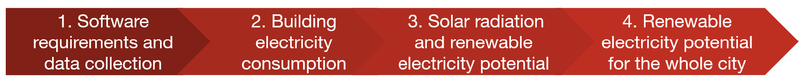
```

**Data Requirements:**  
The following table describes the data required to complete this guide, in what format and from where it should be contributed or downloaded.

| Data description | Format |Source |
| ----------- | ----------- | ----- |
| Annual electricity consumption of municipal buildings      | table format - excel, csv, etc.       |City |
| Vector layer of the administrative borders of the city   | shapefile or GeoJSON format        | City|
|Vector layer of the buildings in the city| shapefile or GeoJSON format | OpenStreetMap (\@ref(open-street-map-osm)) |
| Raster layer of global horizontal irradiation (GHI) | GeoTIFF, ASCII Grid, etc.| The Solar Global Atlas (\@ref(global-solar-atlas)) |
| Raster layer of Land-Use Change and Land-Use Cover (LUCLCC) | GeoTIFF, ASCII Grid, etc.|  Copernicus Land Monitoring Service global maps of land cover & cover changes and related surface area statistics (\@ref(spatial-stratified-sampling-with-qgis)) |

## Guide outputs {-}

|The following list describes the outputs after completing this guide:|
|--------|
| 1. Annual map and analysis of government operated buildings electricity consumption |
| 2. Annual map and analysis of solar radiation of government operated building rooftops |
| 3. Annual map of renewable electricity production potential for government operated buildings | 
| 4. An estimation and range for the solar based renewable electricity rooftop potential of the whole city |

## Acknowledgments {-}

I would like to especially thank Mr. Cesar Carreño and Prof. Dr. Edzer Pebesma that supervised, supported, encouraged, and provided guidance while creating and writing this technical guide. 

Thank you to Laura Noriega for the support and connecting me with the ICLEI SAMS and Argentina teams - Felipe Gaudereto, Thiago Borges David, Victoria Colombo, Sofía Font, Carolina Mesa, Marco A. Massacesi, and Raisa Soares. This connection enabled collaborative meetings with city representatives from Rosario and La Plata, Argentina for data collection, and feedback which will assist cities worldwide to implement renewable energy targets.

# Open source software and data 

This chapter introduces the open concept, what is the added value of using open source technologies, and how it can be implemented in different use-cases.

According to the definition of the Open Knowledge Foundation ^[Open Knowledge Foundation. The Open Definition. Retrieved August 2021, from http://opendefinition.org/], *__"Knowledge is open if anyone is free to access, use, modify, and share it-subject, at most, to measures that preserve provenance and openness."__* 
Openness in regards to information technologies is comprised of the following components:

* **Open source software** - free and open collaborative software development.
* **Open data** - freely accessible, distributed, and usable data.
* **Open hardware** - physical products and systems designed to employ publicly shared information. 
* **Open standards** - specifications for hardware, software, or data developed in a transparent process.

In this guide, we will use open source software and open data in the geospatial context.   
Open source geospatial software includes a broad range of libraries, tools, applications, and platforms developed and released under open standards. The most known software ecosystem for geospatial software is the Open Source Geospatial Foundation's (OSGeo) ^[Homepage - OSGeo. Retrieved August 2021, from https://www.osgeo.org/] that supplies essential libraries and validated software packages for geospatial analysis and visualizations. 
A popular software project from OSGeo is QGIS Desktop which will be presented in the next part of this chapter.  
Open geospatial data includes information that is collected collaboratively and publicly available online. This can be in by either paid or unpaid crowdsourcing, public participation for data collection, etc. The most widely known example of a global open geospatial dataset collaboratively maintained through a global community of contributors is OpenStreetMap (OSM) ^[OpenStreetMap. Retrieved August 2021, from https://www.openstreetmap.org/], which will be presented later on in the chapter.

Next, we will go over the open source software and data used for implementing the steps in this guide.

## QGIS
```{r img3, out.width='50%', fig.align='center', echo=FALSE}
knitr::include_graphics("images/qgis_logo.png")
```

**QGIS** is a leading free and open source desktop GIS. It allows to create, edit, visualize, analyze and publish geospatial information on Windows, Mac OS, Linux, BSD, and Android.  
QGIS is released under the GNU Public License (GPL) Version 2 or any later version. Using QGIS under this license enables users to inspect and modify the source code and guarantees access to a GIS program that is free of cost and can be freely modified ^[Welcome to the QGIS project!. Retrieved 25 August 2021, from https://qgis.org/en/site/].

QGIS supports raster, vector, mesh, and point cloud data in a range of standard formats:

* Raster formats: GeoPackage, GeoTIFF, GRASS, ArcInfo binary and ASCII grids, ERDAS Imagine SDTS, WMS, WCS, PostgreSQL/PostGIS, and other GDAL supported formats.
* Vector formats: GeoPackage, ESRI Shapefiles, GRASS, SpatiaLite, PostgreSQL/PostGIS, MSSQL, Oracle, WFS, Vector Tiles, and other OGR supported formats.
* Mesh formats: NetCDF, GRIB, 2DM, and other MDAL supported formats.
* Point-cloud format: LAS/LAZ and EPT datasets.

> In this guide the QGIS version is 3.12.3-București. Different versions might have slight differences in the user interface.

```{r img4, out.width='100%', fig.align='center', echo=FALSE, fig.cap="QGIS Desktop User Interface [12]"}
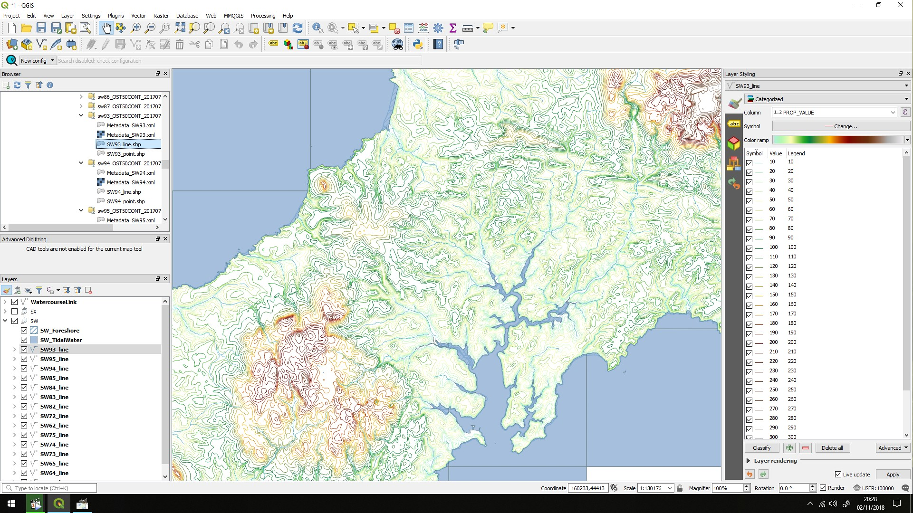
```

In this guide, we will upload 2 types of data layers to analyze them using various tools from the QGIS desktop platform -   

1.[vector layers](https://docs.qgis.org/2.8/en/docs/gentle_gis_introduction/vector_data.html) - data that provides a way to represent real world features within the GIS environment using geometry. The geometry is made up of one or more interconnected vertices creating a point, line or polygon feature.  
2.[raster layers](https://docs.qgis.org/2.8/en/docs/gentle_gis_introduction/raster_data.html) - are made up of a matrix of pixels (also called cells), each containing a value that represents the conditions for the area covered by that cell. (*See \@ref(fig:img555)* )^[Intro to GIS. Retrieved November 2021, from https://serc.carleton.edu/eyesinthesky2/week5/intro_gis.html]

```{r img555, out.height='50%', fig.align='center', echo=FALSE, fig.cap="Vector and Raster Layers [13]"}
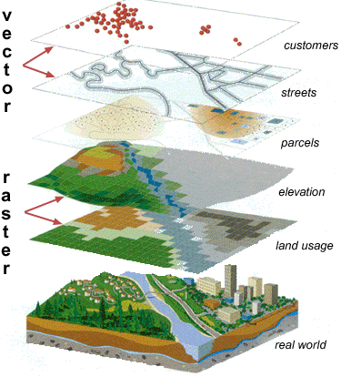
```

To download QGIS Desktop click [here](https://qgis.org/en/site/forusers/download.html).
For the full QGIS Documentation including a user guide and training manual click [here](https://docs.qgis.org/3.16/en/docs/index.html).

## QuickMapServices (QMS)
```{r img5, out.width='50%', fig.align='center', echo=FALSE}

```

**QuickMapServices (QMS)** is an open catalog of geodata sources developed by NextGIS^[https://nextgis.com/about/], that can be added to GIS software such as QGIS.

In QGIS the QMS has a downloadable [plugin](https://plugins.qgis.org/plugins/quick_map_services/) which enables to load multiple geographical layers to the user interface. 

QMS include the following services: 

1.TMS - [Tile Map Service](https://www.ogc.org/standards/wmts).  
2.WMS - [Web Map Service](https://www.ogc.org/standards/wms).  
3.WFS - [Web Feature Service](https://www.ogc.org/standards/wfs).  
4.[GeoJSON](https://geojson.org/) - geodata in GeoJSON format. 

In this guide, we will use QMS to validate the building rooftops areas calculated in QGIS and to digitize building rooftops for the sampling analysis.
For more information on QMS click [here](https://qms.nextgis.com/faq).

## RStudio
```{r img6, out.width='50%', fig.align='center', echo=FALSE}
knitr::include_graphics("images/rstudio_logo.png")
```

**RStudio** is open-source software for data science, scientific research, and technical communication Integrated Development Environment (IDE) for R, a programming language for statistical computing and graphics. It is available in two formats: RStudio Desktop is a regular desktop application while RStudio Server runs on a remote server and allows accessing RStudio using a web browser.

In this guide, we will use RStudio for statistical computations to estimate the solar potential for the whole city. To download RStudio click [here](https://www.rstudio.com/products/rstudio/download/#download).

## Open Street Map (OSM)
```{r img7, out.width='20%', fig.align='center', echo=FALSE}

```

**OpenStreetMap (OSM)** is a collaborative project to create a free and editable geographic database of the world. The geodata underlying the maps is considered the primary output of the project. The creation and growth of OSM has been motivated by restrictions on use or availability of map data across much of the world. It is possible to download map data from the OpenStreetMap dataset in a number of ways. One convenient way is using the Geofabrik download server that extracts data from the OpenStreetMap project which are updated every day. Geofabrik is a consulting and software development firm specializing in OpenStreetMap services. The server allows the user to select the continent and country of interest to download the available OSM data.

In this guide OSM data is downloaded using the Geofabrik online server for extracting a vector layer of the city building footprints. To download OSM data from the Geofabrik online server click [here](http://download.geofabrik.de/).

## Global Solar Atlas 
```{r img8, out.width='60%', fig.align='center', echo=FALSE}

```

[The World Bank](www.worldbank.org/) has created together with [Solargis](https://solargis.com/), a [Global Solar Atlas](https://globalsolaratlas.info/map) with a series of global, regional and country GIS data layers and poster maps. The Global Solar Atlas aims to support the transition to solar based power in countries worldwide. This work is funded by the [Energy Sector Management Assistance Program (ESMAP)](http://www.esmap.org/RE_Mapping), and is part of a global ESMAP initiative on Renewable Energy Resource Mapping that includes biomass, small hydro, solar and wind.

The Global Solar Atlas is an open data initiative that makes available both modeled and measured solar radiation and meteorological data. The data available for downloading is described [here](https://globalsolaratlas.info/support/data-outputs).

In this guide, we will use a raster layer covering the long term yearly average of global horizontal irradiation (GHI) in kWh/m^2^ of Argentina, from the period 1999-2018, with a spatial resolution of 9 arcsec (~250 m). To download data by country from the Global Solar Atlas click [here](http://https://globalsolaratlas.info/download/).

# Mapping electricity consumption

For mapping the building electricity consumption of municipal buildings, we will use the QGIS interface. For this chapter and chapter \@ref(solar-radiation-and-renewable-electricity-calculation) we will use data from the city of Rosario, Argentina. 
Once we start QGIS, we immediately open an untitled new project, to save the project click on the **Project** icon on the menu bar (which provides access to QGIS functions using standard hierarchical menus) click on the **Save As...** button there we can decide the project name and in which directory we want to save our project. Every time we make changes we can click the **save** button and our project will be automatically  saved. (*See \@ref(fig:img-33335)*)

```{r img-33335, out.width='100%', fig.align='center', echo=FALSE, fig.cap="Save QGIS Project"}
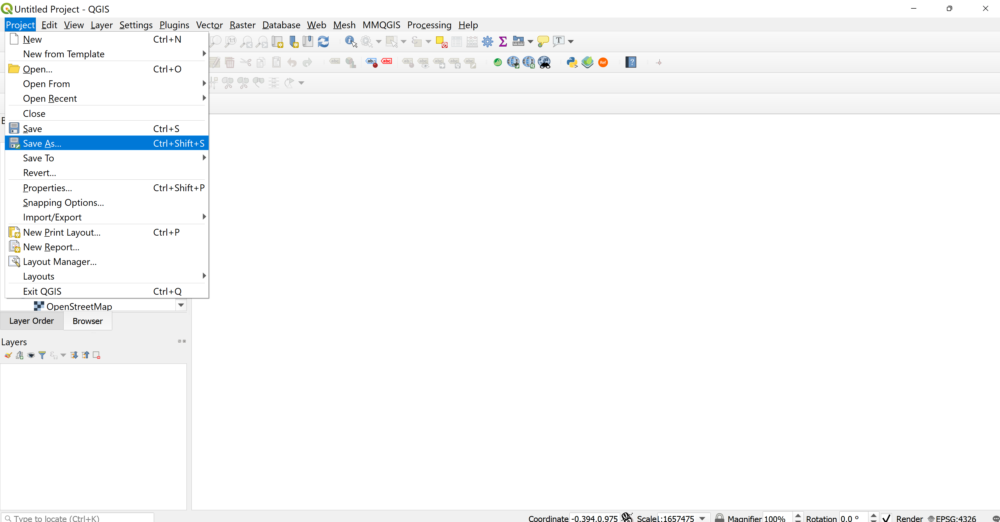
```

## Adding table data to QGIS

As a first step, we would like to add to QGIS table data of electricity consumption. To do this we will go to the menu bar and click on the **Layer Menu**. The **Layer Menu** provides a large set of tools to create, add or save data sources. A table is usually in formats of delimited text e.g. CSV, therefore we will click on the **Add Delimited Text Layer** option. (*See \@ref(fig:img-9)*)

```{r img-9, out.width='100%', fig.align='center', echo=FALSE, fig.cap="Add Table"}
knitr::include_graphics("images/qgis2.png")
```

Next the **Data Source Manager** will open, and we can click on the **three dots (...)** on the top right corner to select the file we would like to add from our local directory. 
In this window, QGIS will automatically update the File Format, Record and Fields Options, and the Geometry Definition information. Under the Layer Settings, we can see a preview of the table <span style="color: blue;">Edificios_Publicos_Rosario.csv</span>, the **Total Consumos** is the column or better known as the field of current building electricity consumption in Rosario.  
Once we finish validating all the information in our table, we can click on **Add** on the bottom right and see our table data on the bottom left side under **Layers** . (*See \@ref(fig:img-10) and \@ref(fig:img-101)*)

```{r img-10, out.width='100%', fig.align='center', echo=FALSE, fig.cap="Data Source Manager"}
knitr::include_graphics("images/qgis3.png")
```
```{r img-101, out.width='100%', fig.align='center', echo=FALSE, fig.cap="Layers Panel"}
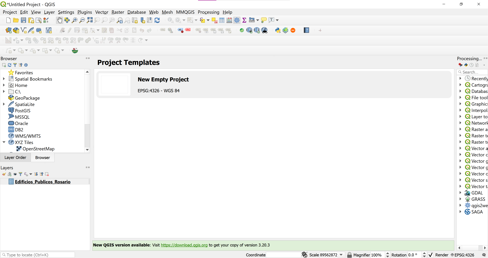
```

> *This data is not open data. In this guide, the data about municipal building electricity consumption was contributed by the city of Rosario, Argentina.*

This guide can also be implemented without mapping the current electricity consumption of buildings but this data can provide information regarding the non-renewable and renewable electricity balance produced for a building. 

## Adding vector layers to QGIS 

To add vector layers to QGIS we will go to the **Layer Menu** again and click the **Add Vector Layer** option. A **Data Source Manager** window will open and we can click on the **three dots (...)** on the right top corner to select the file we would like to add from our local directory. This time the file format needs to be in a vector file format such as an Esri shapefile (.shp) or a GeoJSON. Here you can see our file is in a .shp format, the file contains the footprints (also known as a polygon layer) of the municipal buildings in Rosario, to add it we click on the **Add** button. (*See \@ref(fig:img-11) and \@ref(fig:img-111)*) 

```{r img-11, out.width='100%', fig.align='center', echo=FALSE, fig.cap="Add Vector Layer"}
knitr::include_graphics("images/qgis1.png")
```
```{r img-111, out.width='100%', fig.align='center', echo=FALSE, fig.cap="Add Vector Layer"}
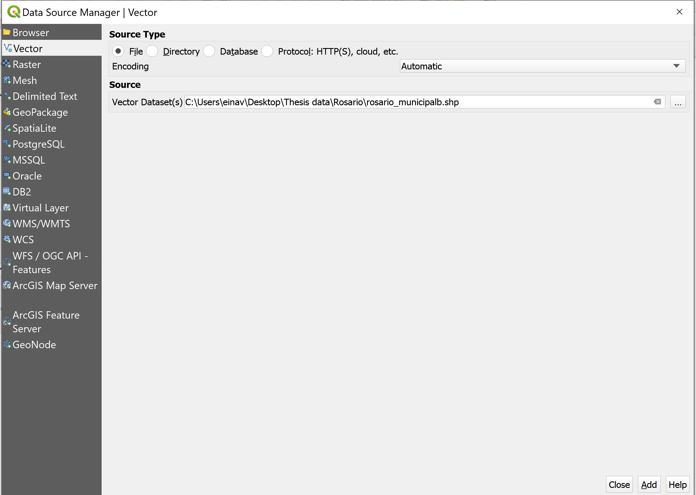
```

## Joining vector layers and table data

Next, we would like to join the table data containing the electricity consumption with the polygon layer of the buildings. 
First, we will right click on the layer to which we want to join attributes to, in our case it is the polygon layer of the buildings called here <span style="color: blue;">rosario_municipalb.shp</span>. Once we right click on the layer we will select the last button called **Properties** and **The Vector Properties Dialog** window will open. This dialog provides general settings to manage the appearance of layer features in the map (symbology, labeling, diagrams), interaction with the mouse (actions, map tips, form design). It also provides information about the layer, this is a good opportunity to check what is our layer's coordinate reference system (CRS), here we can see the layer is in The World Geodetic System 1984 (WGS84). (*See \@ref(fig:img-12) and \@ref(fig:img-121)*) (The geographic layers in our QGIS project must be in the same CRS. [For more information about CRS](https://en.wikipedia.org/wiki/Spatial_reference_system))

```{r img-12, out.width='100%', fig.align='center', echo=FALSE, fig.cap="Layer Properties"}
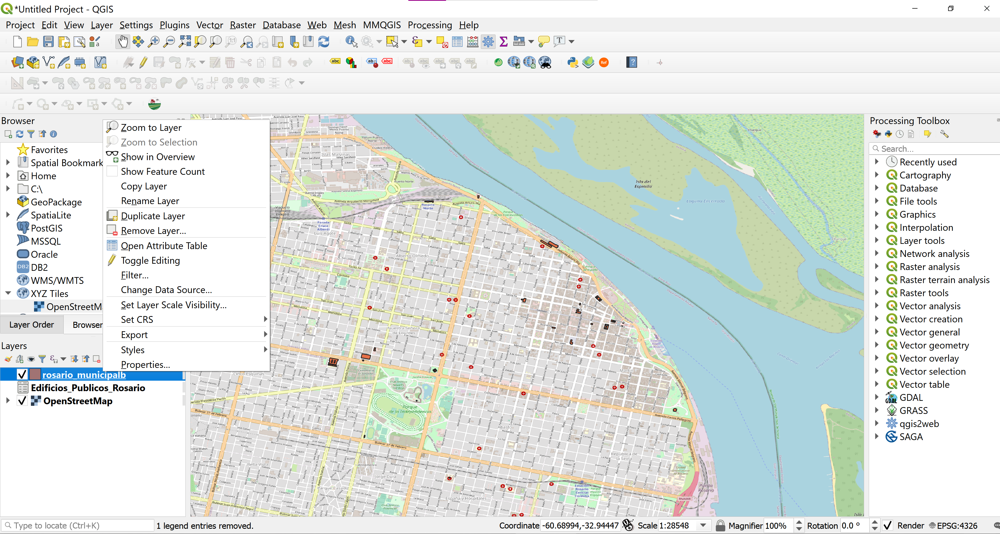
```
```{r img-121, out.width='100%', fig.align='center', echo=FALSE, fig.cap="Layer Information"}
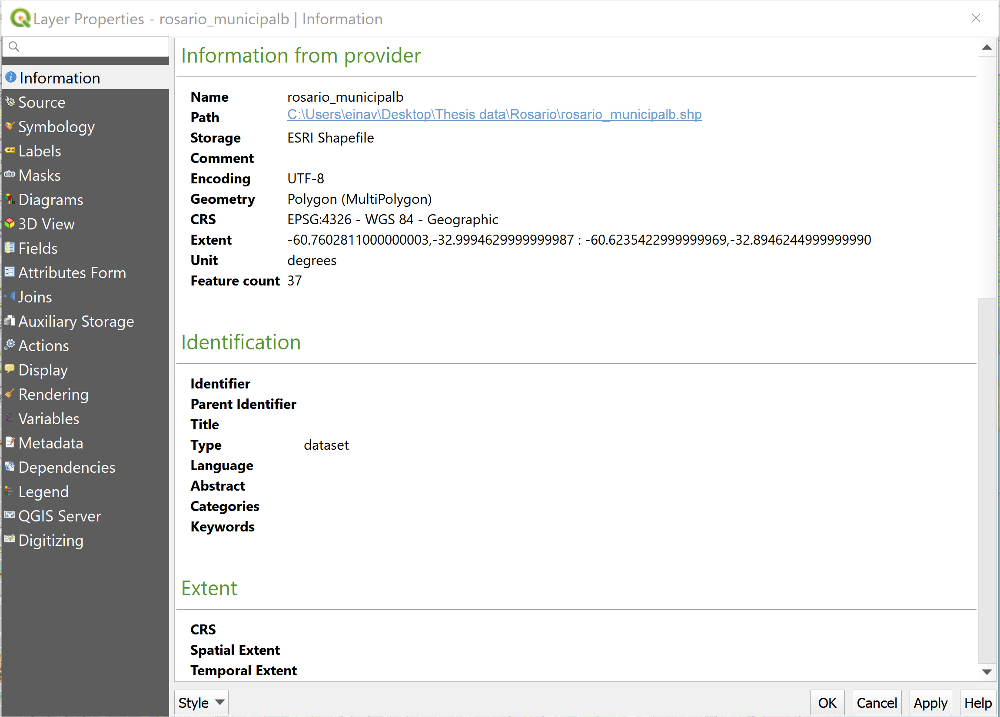
```

On the left side panel, we can see an option called **Joins**. Join is associating records in one table or layer with records in another table or layer through a common field, known as a key. The join between a table of data to a layer is based on the value of a field that can be found in both tables. The name of the field does not have to be the same, but the data type must be the same; you join numbers to numbers, strings to strings, and so on ([for more information about data types](https://dataled.academy/guides/data-types/)).  
To join between the <span style="color: blue;">rosario_municipalb</span> layer and the <span style="color: blue;">Edificios_Publicos_Rosario</span> we will click on the **+** sign on the bottom left and the **Edit Vector Join** window will open. In this window we can select the table or layer we would like to join attributes from and what would be the **Join Field** of that table or layer and which field is associated with the same key in the target layer or table. In addition, we can choose if we want to associate all fields in the target layer or table or choose specific ones, in our case we are interested joining only the **Total Consumos** field. 
Once we are done editing, we can click on the **OK** button and then see the join configuration, to apply it on the target layer, we click **Apply** on the bottom right. (*See \@ref(fig:img-13) and \@ref(fig:img-131)*)

```{r img-13, out.width='100%', fig.align='center', echo=FALSE, fig.cap="Join"}
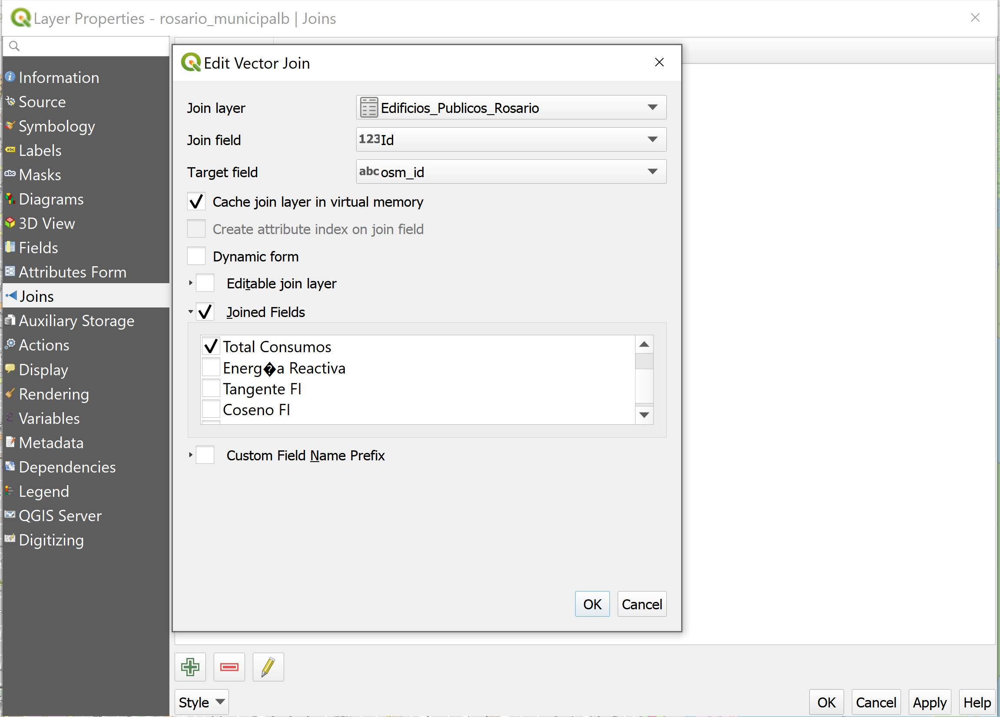
```
```{r img-131, out.width='100%', fig.align='center', echo=FALSE, fig.cap="Join"}
knitr::include_graphics("images/join2.png")
```

To make sure the field was added correctly we can open the **Attribute Table** of the <span style="color: blue;">rosario_municipalb</span> layer
and check that the column was indeed joined. (*See \@ref(fig:img-14) and \@ref(fig:img-141)*)

```{r img-14, out.width='70%', fig.align='center', echo=FALSE, fig.cap="Attribute Table"}
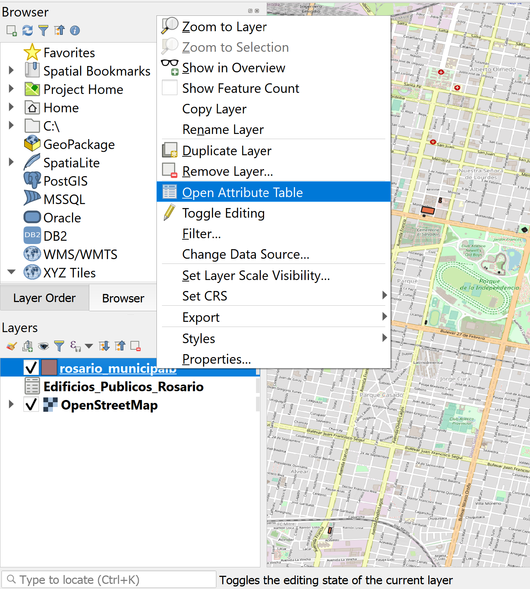
```
```{r img-141, out.width='100%', fig.align='center', echo=FALSE, fig.cap="Attribute Table"}
knitr::include_graphics("images/attribute_table2.png")
```

## Consumption visualizations

Now that we have the building electricity consumption associated with the polygon layer of the municipal buildings, we can visualize the consumption using **The Symbology tab**.

First we will right click on our <span style="color: blue;">rosario_municipalb</span> layer, then we select the **Properties** button and **The Vector Properties Dialog** window will open. On the right side we will see **The Symbology tab**, this tab provides a comprehensive tool for rendering and symbolizing vector data. At the top, we can choose between different [rendering options](https://docs.qgis.org/3.16/en/docs/user_manual/working_with_vector/vector_properties.html#symbology-properties).  
For visualizing the electricity consumption we will select the **Graduated** rendering option and click on the **classify** button to classify our total electricity consumption into 9 Equal Count (Quantile) breaks, meaning that each class will have the same number of elements. Then we can see our buildings colored according to their class. (*See \@ref(fig:img-15) and \@ref(fig:img-16)*)   
```{r img-15, out.width='100%', fig.align='center', echo=FALSE, fig.cap="Layer Visualizations"}
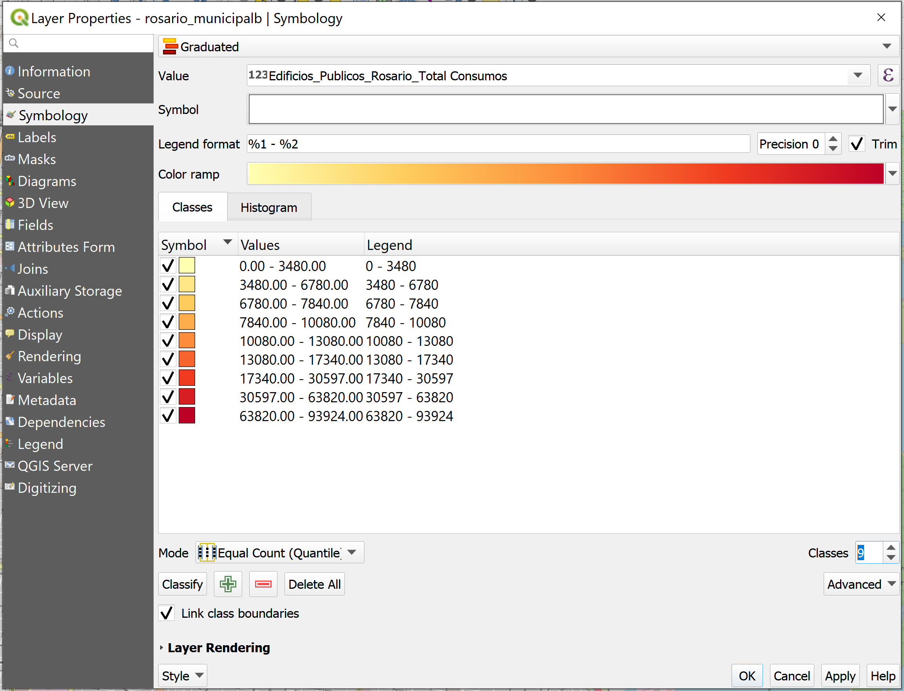
```
```{r img-16, out.width='100%', fig.align='center', echo=FALSE, fig.cap="Layer Visualizations"}
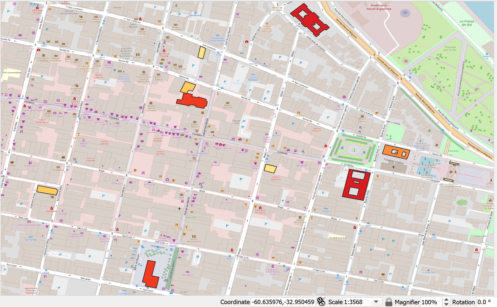
```

# Solar radiation and renewable electricity calculation 
In this chapter, we will calculate the renewable electricity production potential for our building rooftops using a GHI raster layer from \@ref(global-solar-atlas). 
For calculating the building rooftop solar radiation and renewable electricity potential we will continue to use our project from Chapter \@ref(mapping-electricity-consumption) in the QGIS interface.  

## Adding raster layers to QGIS

To add raster layers to QGIS we will go to the **Layer Menu** again and click the **Add Raster Layer** option. A **Data Source Manager** window will open and we can click on the **three dots (...)** on the right top corner to select the file we would like to add from our local directory. This time the file format needs to be in a raster file format such as a GeoTIFF (.tif). Here you can see our file is in a .tif format, the file contains an irradiation value for each pixel of the image, to add it we click on the **Add** button. (*See \@ref(fig:img-17) and \@ref(fig:img-171)*

```{r img-17, out.width='100%', fig.align='center', echo=FALSE, fig.cap="Add Raster"}
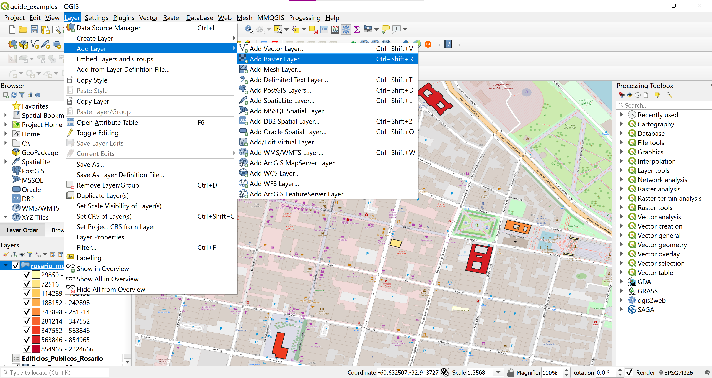
```
```{r img-171, out.width='100%', fig.align='center', echo=FALSE, fig.cap="Add Raster"}
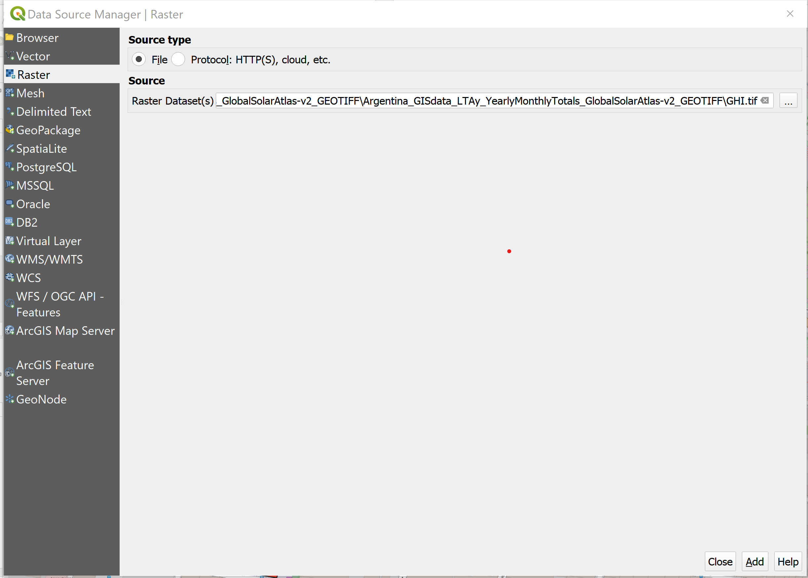
```

## Extracting raster values to vector layers

Next, we would like to calculate the GHI for the building rooftops so we can translate the values to electricity. For this, we need to use the **Zonal statistics** algorithm. This algorithm Calculates statistics of a raster layer for each feature of an overlapping polygon vector layer adding the new statistics fields to it. 
First, we will select the **Processing** tab from the menu bar and add the **Processing Toolbox** to our user interface. (*See \@ref(fig:img-18)*)

```{r img-18, out.width='100%', fig.align='center', echo=FALSE, fig.cap="Processing Toolbox"}
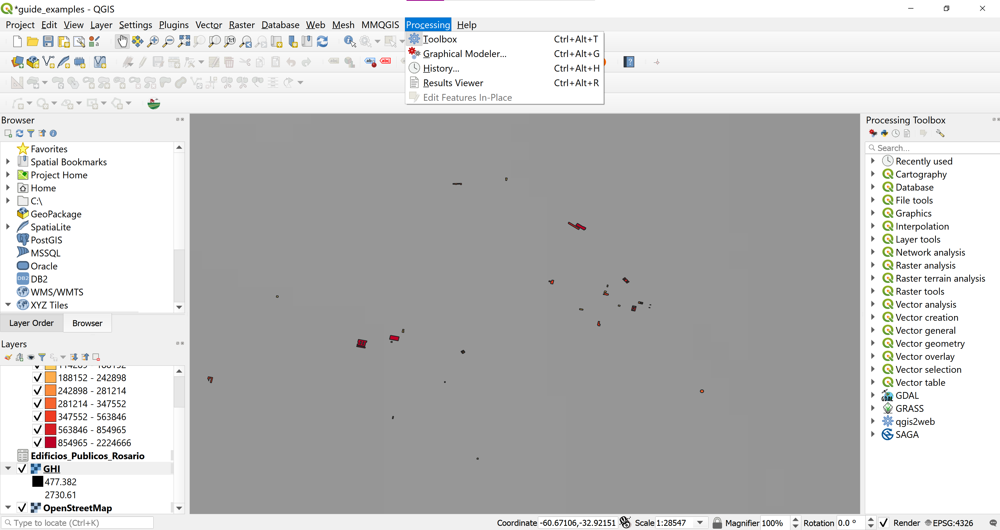
```

In the **Processing Toolbox** search bar we can search for the tool we would like to use - **Zonal statistics**. Once we press the **Zonal statistics** algorithm configuration window will open and we can choose our raster layer and our vector layer containing the zones for calculation. Under the two layer inputs, we can select a prefix for the field name which will contain the algorithm's calculations, we will use the predefined **\_** prefix. (*See \@ref(fig:img-181)*)  
The last tab called **Statistics to calculate** is where we can select how the algorithm will calculate the pixel values over the polygons. Here we would like to average the pixel value of irradiation throughout the rooftop. Therefore, we select **Mean** click the **OK** button and then the **Run** button. (*See \@ref(fig:img-182)*)
To see our calculations we can open the attribute table of the <span style="color: blue;">rosario_municipalb</span> layer. (*See \@ref(fig:img-183)*)

```{r img-181, out.width='100%', fig.align='center', echo=FALSE, fig.cap="Zonal Statistics"}
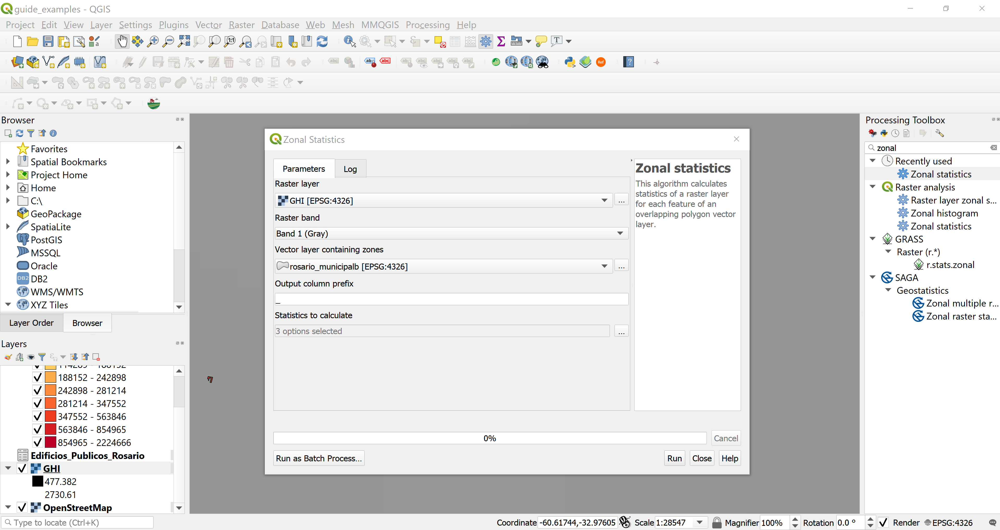
```
```{r img-182, out.width='70%', fig.align='center', echo=FALSE, fig.cap="Zonal Statistics"}
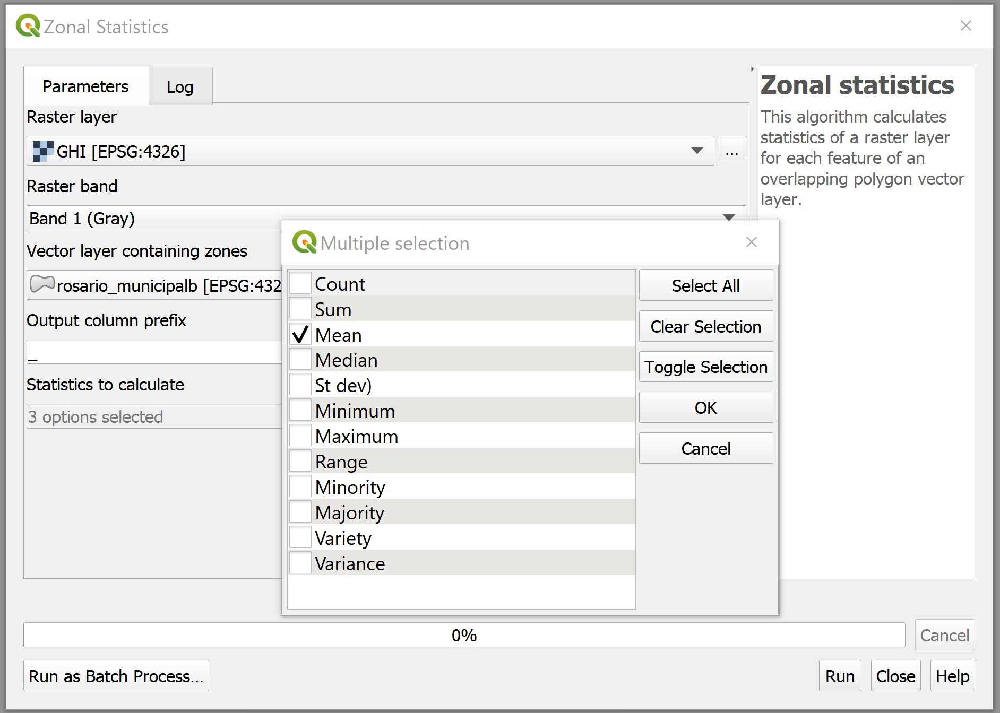
```
```{r img-183, out.width='100%', fig.align='center', echo=FALSE, fig.cap="Attribute Table with Mean GHI Calculation"}
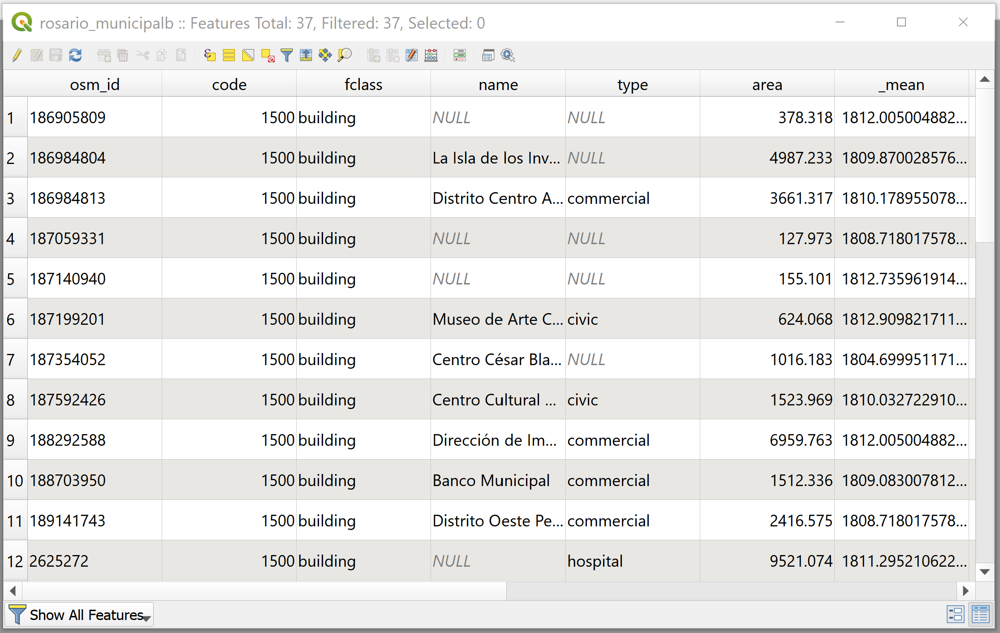
```

## QGIS Field calculator

Now we would like to calculate the building's rooftop area, the solar radiation each rooftop absorbs, and how much of the solar radiation can be translated into renewable electricity. 
For these calculations we will use the **Field Calculator** operator in the attribute table. 
This calculator enables calculations, based on existing attribute values or defined functions, for instance, to calculate the length or area of geometry features. The results can be used to update an existing field or to create a new field.  

### Building rooftop area

To calculate the building rooftop area, we will open the <span style="color: blue;">rosario_municipalb</span> layer's attribute table and click on the **Field Calculator** operator. We want to create a new field called **area**, then we will define the type of the field as a **Decimal number**. Next, we see the **Expression** builder log, where we can select which calculation is calculated for that field, we can use the search bar to search for predefined expressions. For our layer, we will use a **Geometry** expression and calculate the area for the building rooftops, the **$** sign indicates that the calculation is performed on all the buildings in the layer. Under the expression builder log, we can see an **Output preview** of the values calculated. (*See \@ref(fig:img-19)*)

```{r img-19, out.width='70%', fig.align='center', echo=FALSE, fig.cap="Field Calculator - Area"}
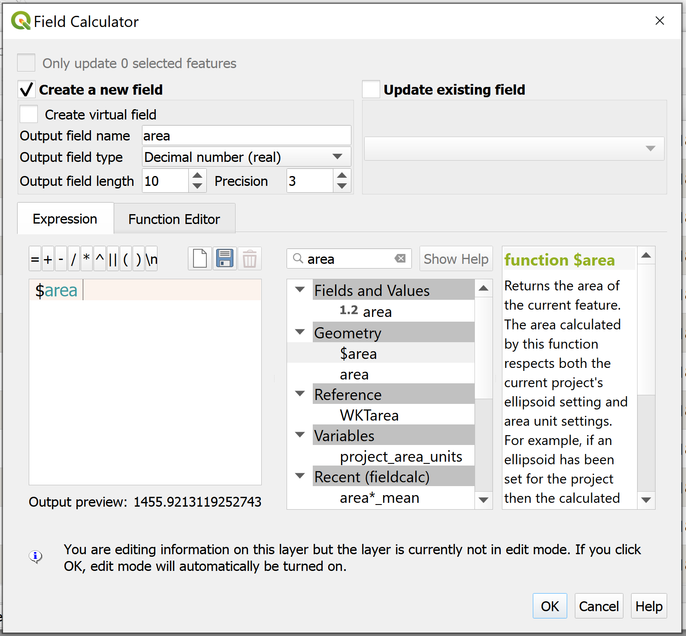
```

Figure \@ref(fig:img-191) shows the attribute table of the <span style="color: blue;">rosario_municipalb</span> layer with the building rooftop area calculated. 

```{r img-191, out.width='100%', fig.align='center', echo=FALSE, fig.cap="Attribute Table with Building Rooftop Area Calculation"}

```

### Usable solar radiation

To calculate the building rooftop solar radiation we will multiply the building rooftop area times the mean GHI value calculated and extracted from the raster layer.

> Important! buildings with rooftops under 30 $m^2$ are not suitable for solar panel installations. 

\begin{equation}
usable\_sr = area * GHI (kWh)
(\#eq:usablesr)
\end{equation} 

we will open the <span style="color: blue;">rosario_municipalb</span> layer's attribute table and click on the **Field Calculator** operator. This time, we want to create a new field named **usable_sr**, then we will define the type of the field as a **Decimal number** and enter in the **Expression** builder log our equation \@ref(eq:usablesr). (*See \@ref(fig:img-192)*)

```{r img-192, out.width='70%', fig.align='center', echo=FALSE, fig.cap="Field Calculator - Usable Solar Radiation"}
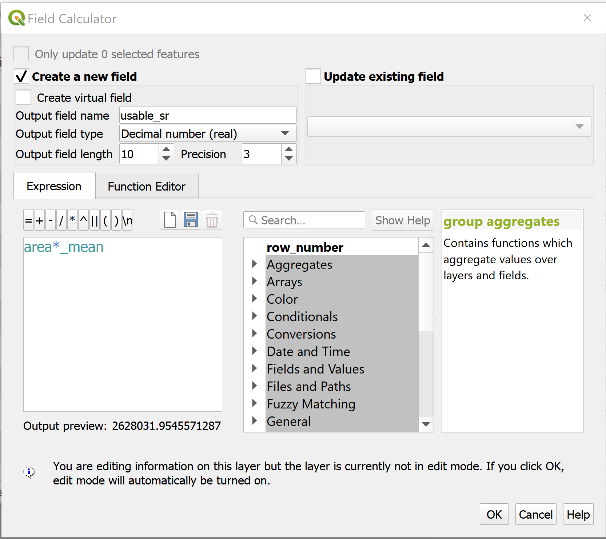
```

Figure \@ref(fig:img-193) shows the attribute table of the <span style="color: blue;">rosario_municipalb</span> layer with the usable solar radiation calculated.

```{r img-193, out.width='100%', fig.align='center', echo=FALSE, fig.cap="Attribute Table with Usable Solar Radiation Calculation"}
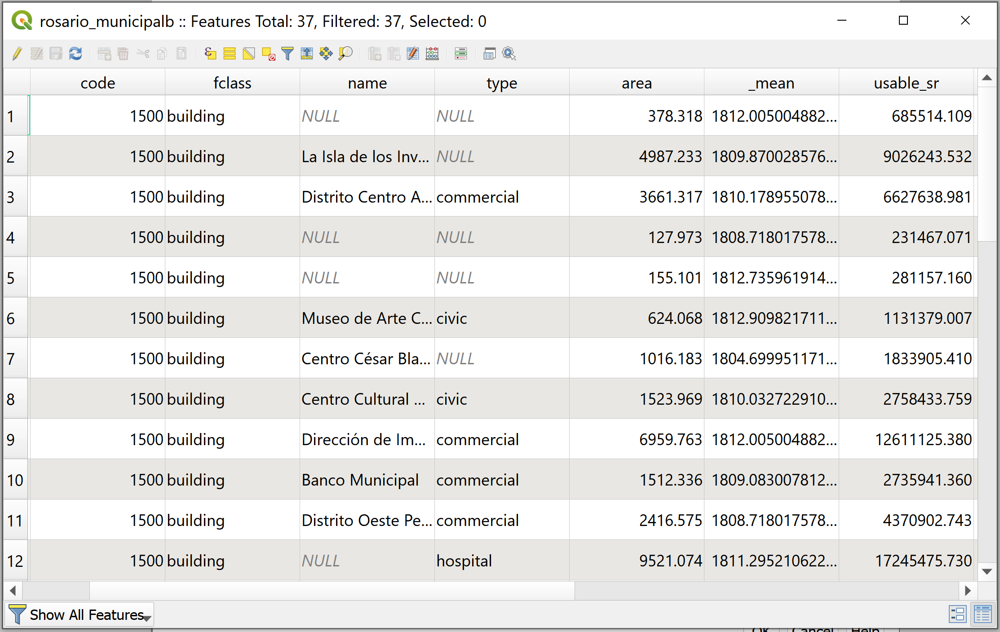
```

### Renewable electricity production

To calculate the building rooftop renewable electricity production potential we will multiply the usable solar radiation times the solar panel efficiency percentage $r$ and a performance ratio percentage $PR$. The United States Environmental Protection Agency (EPA) provides the best estimate of 15 percent efficiency and 86 percent performance ratio. These values mean that the solar panels are capable of converting 15 percent of incoming solar energy into electricity, and then 86 percent of that electricity is preserved as it goes through the installation.

\begin{equation}
elec\_prod = usable\_sr * r * PR (kWh)
(\#eq:elecprod)
\end{equation} 

we will open the <span style="color: blue;">rosario_municipalb</span> layer's attribute table and click on the **Field Calculator** operator. This time, we want to create a new field named **elec_prod**, then we will define the type of the field as a **Decimal number** and enter in the **Expression** builder log our equation \@ref(eq:elecprod). (*See \@ref(fig:img-194)*)

```{r img-194, out.width='70%', fig.align='center', echo=FALSE, fig.cap="Field Calculator - Renewable Electricity Production"}
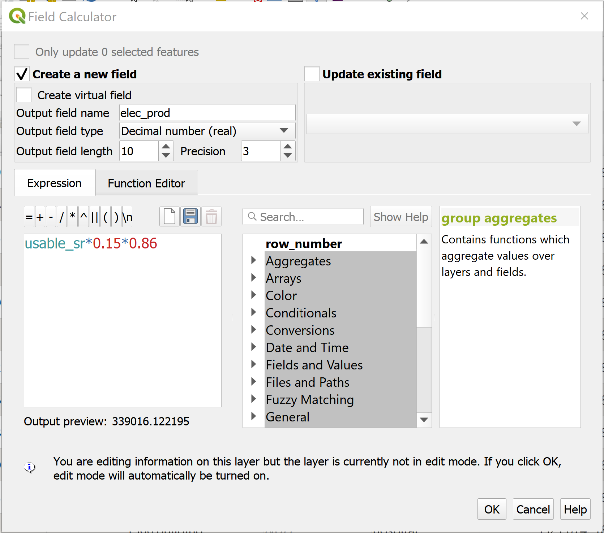
```

Figure \@ref(fig:img-195) shows the attribute table of the <span style="color: blue;">rosario_municipalb</span> layer with the renewable electricity production potential calculated.

```{r img-195, out.width='100%', fig.align='center', echo=FALSE, fig.cap="Attribute Table with Usable Solar Radiation Calculation"}
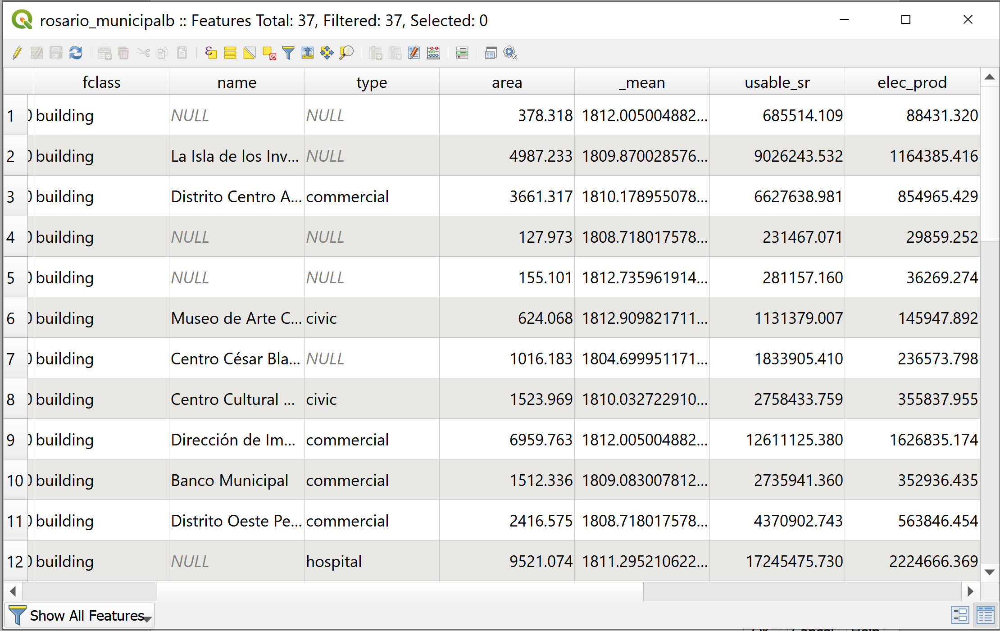
```

As the last step, we can calculate what would be the building's renewable electricity balance if its rooftop would be equipped with solar panels. 
For this, we will open once again the **Field Calculator** operator, create a field named **rene_elec** and enter the following equation \@ref(eq:reneelec):

\begin{equation}
rene\_elec = elec\_prod - elec\_consu (kWh)
(\#eq:reneelec)
\end{equation} 

Where we subtract the building electricity consumed by the renewable electricity production potential. There are 3 possible scenarios for the buildings electricity balance:

1. If the result of the equation is positive $(+)$, then the building can supply its own electricity from renewable electric energy and more. 
2. If the result of the equation is negative $(-)$, then the building can supply a limited amount of renewable electric energy out of the total electric consumption. 
3. If the result of the equation is zero $(0)$, then the building can supply its electricity from renewable electric energy.

Figure \@ref(fig:img-196) shows the attribute table of the <span style="color: blue;">rosario_municipalb</span> layer with the renewable electricity balance calculated.

```{r img-196, out.width='100%', fig.align='center', echo=FALSE, fig.cap="Attribute Table with Usable Solar Radiation Calculation"}
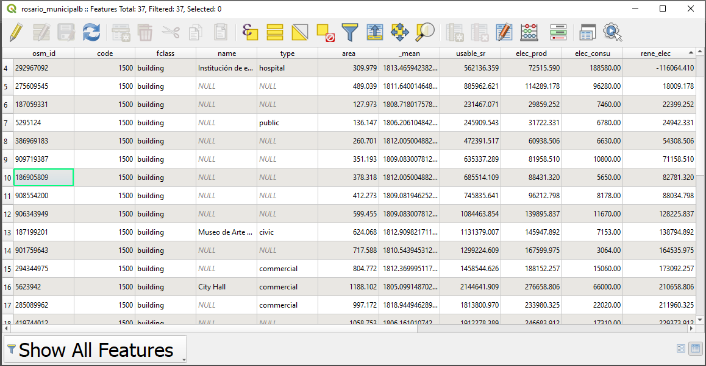
```

# Renewable electricity estimation for the whole city

In this chapter, we will estimate the renewable electricity production potential for the whole city. For this estimation it is possible to continue using our project from Chapters \@ref(mapping-electricity-consumption) and \@ref(solar-radiation-and-renewable-electricity-calculation) in the QGIS interface but this time we will use data from the city of La Plata, Argentina.

## What is sampling and spatial sampling?

Sampling is the process of selecting a part of a population to estimate the characteristics of the whole population. The characteristics could be the total or mean value of an attribute regarding the population.^[Thompson, S. (2012). Sampling. Hoboken, N.J.: Wiley.] ^[Wang, J.-F., Stein, A., Gao, B.-B., Ge, Y., A review of spatial
sampling. Spatial Statistics (2012), doi:10.1016/j.spasta.2012.08.001]  

In spatial sampling, we collect samples in a two-dimensional framework. The sampling scheme is designed to maximize the probability of including the spatial variation of the study population.

There are different methods to collect a sample, in this guide we will focus and compare results between two sampling methods:

1. **Spatial random sampling** - randomly selecting sample points in a study region, where each location has an equal opportunity to be sampled.  
2. **Spatial stratified sampling** - the study region is divided into groups a.k.a. strata by a collective characteristic of the study region (neighborhoods, land use, etc.). Then for each strata, a spatial random sample is collected and combined to one sample.^[Delmelle, E. (2012). Spatial Sampling. The SAGE Handbook Of Spatial Analysis, 182-206. doi: 10.4135/9780857020130.n10]

Therefore, to estimate the total renewable electricity potential for a city, we can collect samples of rooftop buildings using QGIS and QMS.

> Important! to complete the analysis it is essential to have the total number of buildings in the city. This will be discussed in detail in section \@ref(rstudio-calculations)

### Selecting a sample size

When planning a sampling framework the first expected question would be -
**What sample size should be used?**

To answer this question the following issues should be considered:

* What parameters do we want to estimate for the population
* How much is already known about the population
* Spread (variability) of the population
* Practicality: how hard is it to collect the sample data
* How precise we want the final estimates to be

There are various strategies to determine a sample size. We can use a census if we have a small population, use a sample size from a different analysis that is similar to ours, use published statistical tables and use a formula to calculate a sample size.^[Israel, G.D. (1992) Determining Sample Size. University of Florida Cooperative Extension Service, Institute of Food and Agriculture Sciences, EDIS, Florida.] 

In addition, there is an online free calculator to estimate a suitable sample size [here](https://www.qualtrics.com/uk/experience-management/research/determine-sample-size/?rid=ip&prevsite=en&newsite=uk&geo=DE&geomatch=uk#calculator).

In this guide we will use the following formula to decide our sample size:

\begin{equation} 
  n_0 = \frac{Z^2p(1-p)}{e^2} (\#eq:sample)
\end{equation} 

Where $n_0$ is the sample size, $Z^2$ is the confidence level Z-score ([can be found in this table](https://www.sjsu.edu/faculty/gerstman/StatPrimer/z-two-tails.pdf)), $p$ is the estimated proportion of variability in the population and $e^2$ is the margin of error, a.k.a. a confidence interval.

**Usually when we have a large population but we do not know the proportion of variability in the population therefore, we assume $p=0.5$ (the maximum variability).

### La Plata sample size calculation

For the city of La Plata, we will use formula \@ref(eq:sample) with a 5% confidence interval to estimate a suitable sample size.

\begin{equation} 
  n_0 = \frac{1.96^2*0.5*(1-0.5)}{0.05^2} = 384.16 (\#eq:sample1)
\end{equation} 

Therefore the most suitable sample to collect for La Plata would be 384 building rooftops.

In this guide we will collect two spatial random samples - 100 samples, 300 samples, and both samples combined to observe the differences and select the most accurate approach when estimating renewable electricity potential for the whole city.

After spatial random sampling, we will examine the estimation of renewable electricity potential with spatial stratified sampling. The sample size for stratified sampling depends on the aforementioned issues. We can decide first on how to divide our buildings into strata and then use equation \@ref(eq:sample).
In this guide we first compute 60 spatial random points in each strata for equal size stratification. Then we compute 95 spatial random points for the built up area and 5 points for the non built up area for optimal allocation stratification. 
The decision to use these sample sizes, is determined by the spread of the buildings in La Plata and the practicality of collecting the samples.

## Spatial random sampling with QGIS

To create a spatial random sample in QGIS we will need the city's administrative borders polygon. (*See \@ref(fig:img-197)*)

```{r img-197, out.width='100%', fig.align='center', echo=FALSE, fig.cap="La Plata Administrative Border"}
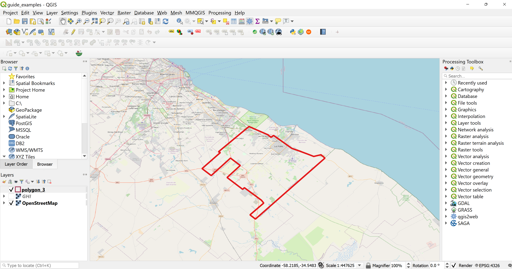
```

Next, we will go to the **Vector Menu**, select the **Research Tools** option and click on the **Random Points in Layer Bounds**. This algorithm creates a new point layer with a given number of random points, all of them within the extent of a given layer. (*See \@ref(fig:img-198)*)

```{r img-198, out.width='100%', fig.align='center', echo=FALSE, fig.cap="Random Points in Layer Bounds"}
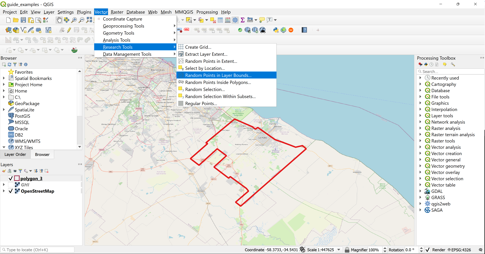
```

The algorithm dialog window opens and we will fill in the parameters according to our analysis. The input layer of the administrative borders of La Plata is called <span style="color: blue;">polygon_3</span>, first we will create 100 random points in the layers extent and save the file as a shapefile by the name <span style="color: blue;">sample1</span>. (*See \@ref(fig:img-199)*)

```{r img-199, out.width='70%', fig.align='center', echo=FALSE, fig.cap="Random Points in Layer Bounds Dialog"}
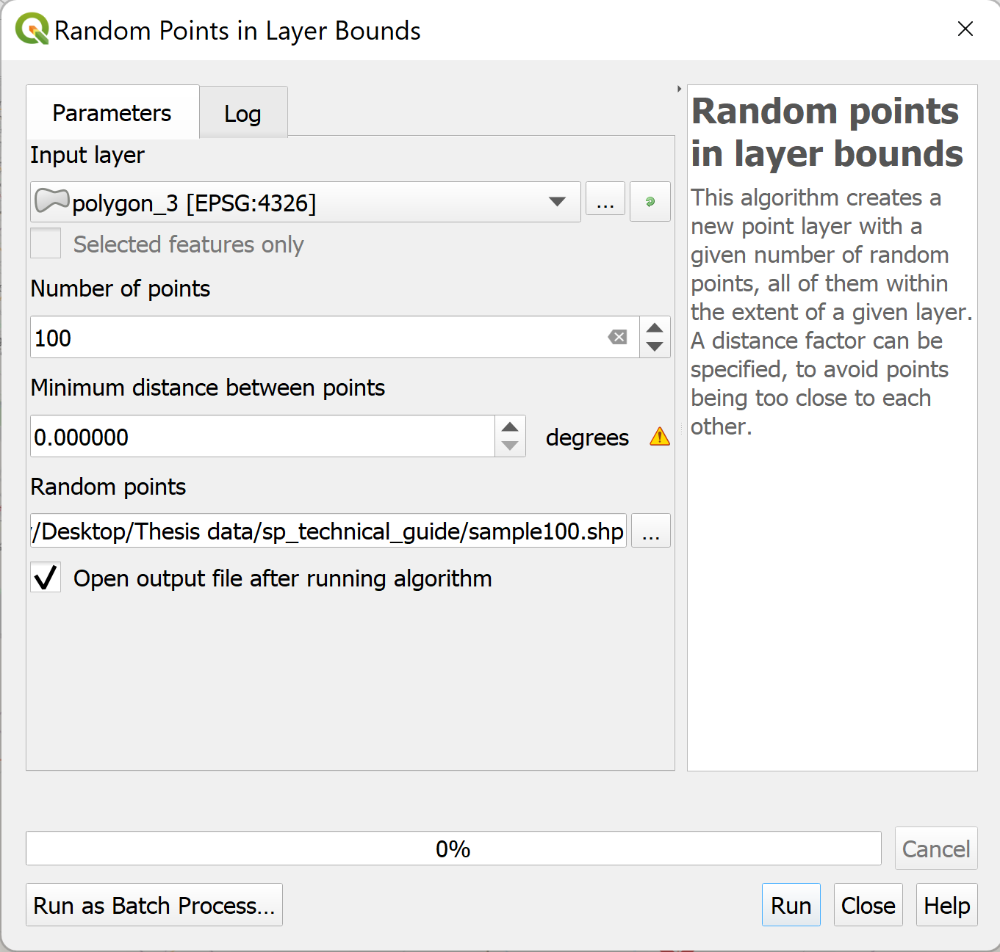
```

We can see that the layer <span style="color: blue;">sample1</span> is uploaded to our QGIS interface. (*See \@ref(fig:img-200)*)

```{r img-200, out.width='100%', fig.align='center', echo=FALSE, fig.cap="Random Points in Layer Bounds Output Layer in QGIS"}
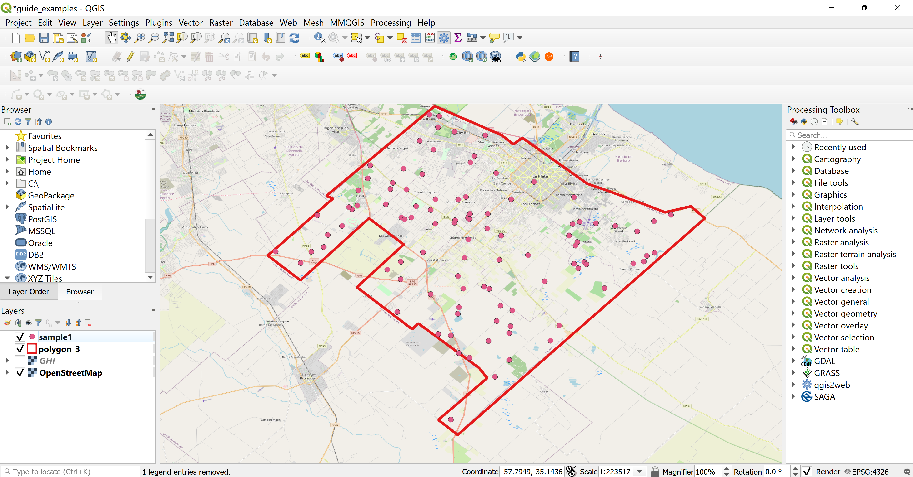
```

### The QMS plugin

Now that we created 100 sample points in the administrative borders of La Plata, we need to see where does the point fall. To do so, we will use QMS to add a TMS layer to the QGIS interface. 
There are many different TMS that are available in QMS ([here](https://qms.nextgis.com/#)), the ideal layer would be the one with a high resolution that was updated recently.   
In this project, we will use two TMS layers to compare and achieve the best accuracy while digitizing the building rooftops.

1. [Google Satellite Hybrid](https://qms.nextgis.com/geoservices/1135/)
2. [ESRI](https://qms.nextgis.com/geoservices/4470/)

To add the QMS plugin to QGIS, click on the **Plugins** menu and select the **Manage and Install Plugins...** option. (*See \@ref(fig:img-201)*)   
The **Plugins Dialog** will open, there we can see all the plugins installed in our QGIS, in the search bar we will type **QMS** and see if the plugin needs to be installed or already exists in the plugin library. (*See \@ref(fig:img-202)*)

```{r img-201, out.width='100%', fig.align='center', echo=FALSE, fig.cap="Plugins Menu"}
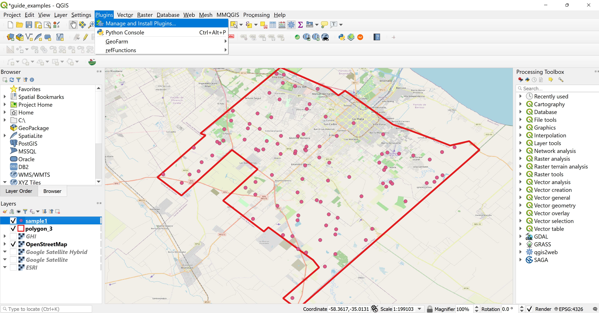
```
```{r img-202, out.width='70%', fig.align='center', echo=FALSE, fig.cap="Plugins Dialog"}
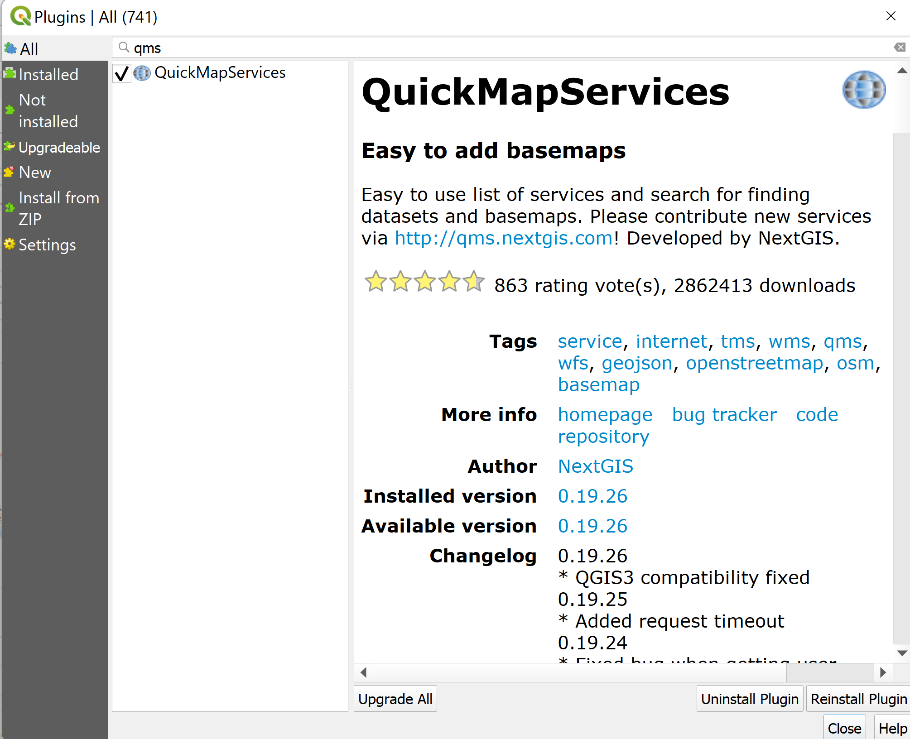
```

To add the **Search QMS** panel we will right click on the menu bar and choose under **Panels** the **Search QMS** panel, the panel appears on the right side under the **Processing Toolbox**. In the search panel we can search for the QMS suitable for our project, here we see the QMS we need under the last used QMS, click **add** on the <span style="color: blue;">Google Satellite Hybrid</span> and <span style="color: blue;">ESRI</span>. (*See \@ref(fig:img-203) and \@ref(fig:img-204)*) 

```{r img-203, out.width='100%', fig.align='center', echo=FALSE, fig.cap="QMS Search Panel"}
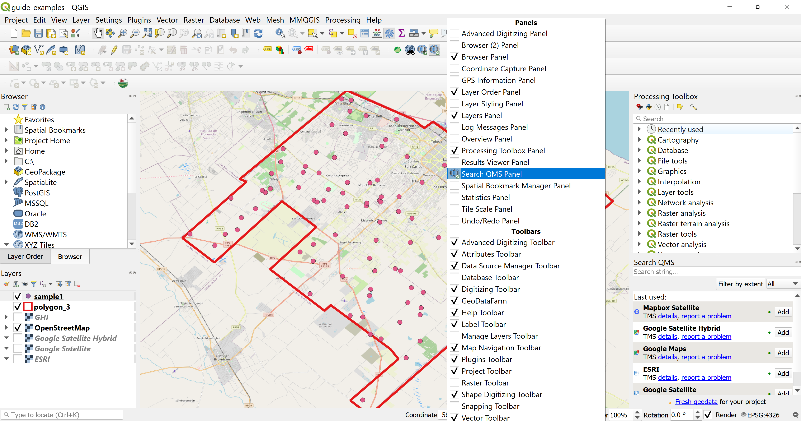
```
```{r img-204, out.width='100%', fig.align='center', echo=FALSE, fig.cap="QMS in QGIS"}
knitr::include_graphics("images/qmsqgis.png")
```

### Digitizing a sample with QMS

Now that we have the <span style="color: blue;">sample1</span> layer and QMS layers in our QGIS interface, the next step is to create a new polygon vector layer.  
To do this we will go to the menu bar, click on the **Layer Menu**, select the **Create Layer** and there choose the **New Shapefile Layer...** option. (*See \@ref(fig:img-205)*)

```{r img-205, out.width='100%', fig.align='center', echo=FALSE, fig.cap="Create Vector Layer"}
knitr::include_graphics("images/createvec.png")
```

The **New Shapefile Layer...** dialog will open and we can fill in the parameters for our layer. This layer we will name <span style="color: blue;">sample100</span>. (*See \@ref(fig:img-206)*)

```{r img-206, out.width='70%', fig.align='center', echo=FALSE, fig.cap="Create Vector Layer Dialog"}
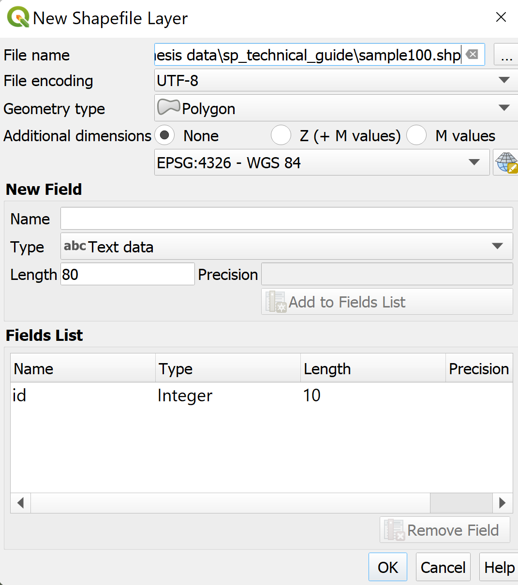
```

Next we will right click on the <span style="color: blue;">sample100</span> layer and select the **Toggle Editing** option. This enables creating new polygons and adding them to the layer. Once the option is set we can see under the menu bar many different editing options in the **Shape Digitizing Toolbar** (if this is not already added, right click on the menu bar and select the toolbar under the **Toolbars** option), each time we want to digitize a new polygon we will click on the **Add Polygon Feature** option. (*See \@ref(fig:img-207) and \@ref(fig:img-208)*)

```{r img-207, out.width='100%', fig.align='center', echo=FALSE, fig.cap="Toggle Editing"}
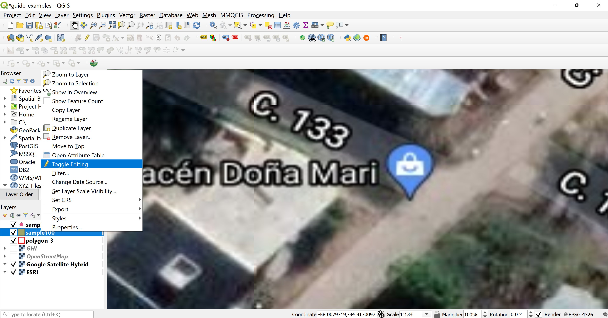
```
```{r img-208, out.width='100%', fig.align='center', echo=FALSE, fig.cap="Shape Digitizing Toolbar - Add Polygon Feature"}
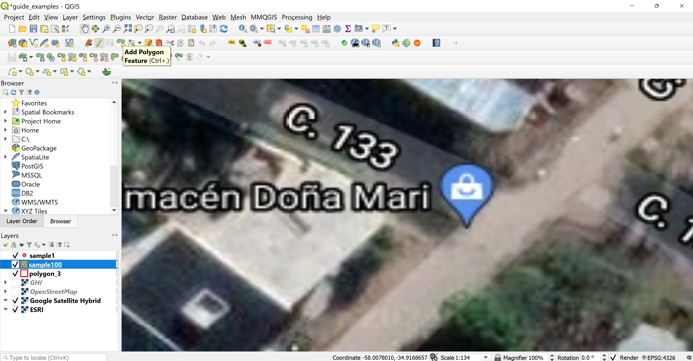
```

Once the layer <span style="color: blue;">sample100</span> is editable we will open the **Attribute Table** of <span style="color: blue;">sample1</span> and select a point according to the id field and click on the **Zoom map to the selected rows** option. 
We will see that the point id = 49, falls on a building rooftop. 
*In \@ref(fig:img-209) we see that id 49 is selected, it is recommended to start from the lowest id to the highest, to remember which point was already digitized.* 

```{r img-209, out.width='100%', fig.align='center', echo=FALSE, fig.cap="Random Point ID=49 from the layer sample1"}
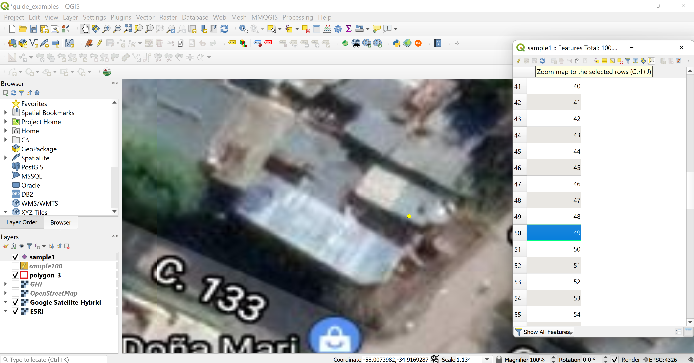
```

Then we will click on the **Add Polygon Feature** option and follow the outline of the building rooftop using the TMS layers to achieve the best accuracy possible.(*See \@ref(fig:img-210)*) 

```{r img-210, out.width='100%', fig.align='center', echo=FALSE, fig.cap="Digitizing ID=49 in the Layer sample100"}
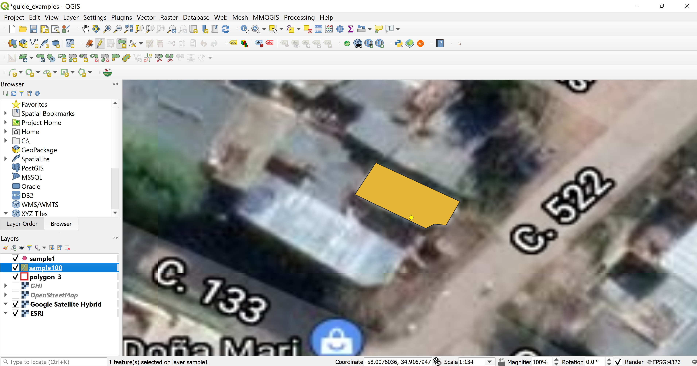
```

For more information about digitizing and editing layers click [here](https://docs.qgis.org/3.16/en/docs/user_manual/working_with_vector/editing_geometry_attributes.html?highlight=digitizing#digitizing-an-existing-layer).

### Including the density factor

Once a random point does not fall on a rooftop building we will digitize it to include it in our analysis as a density factor.  
We will digitize the point in a small triangle shape, so the polygon's area will be under 30 $m^2$. (*See \@ref(fig:img-211)*) 

```{r img-211, out.width='100%', fig.align='center', echo=FALSE, fig.cap="Digitizing to include the Density Factor"}
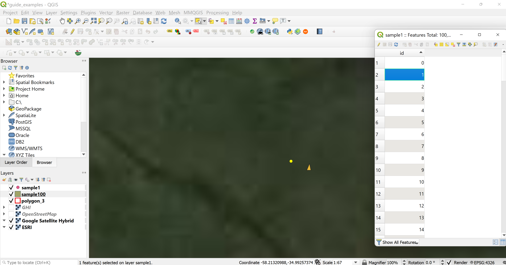
```

### Solar radiation and renewable electricity calculation 

Once finishing digitizing all the sample building rooftops, we will return to the steps described in chapter \@ref(solar-radiation-and-renewable-electricity-calculation) and calculate the solar radiation and renewable electricity for the sample. (*See \@ref(fig:img-212)*) 

```{r img-212, out.width='100%', fig.align='center', echo=FALSE, fig.cap="Sample100 Attribute Table with Calculations"}
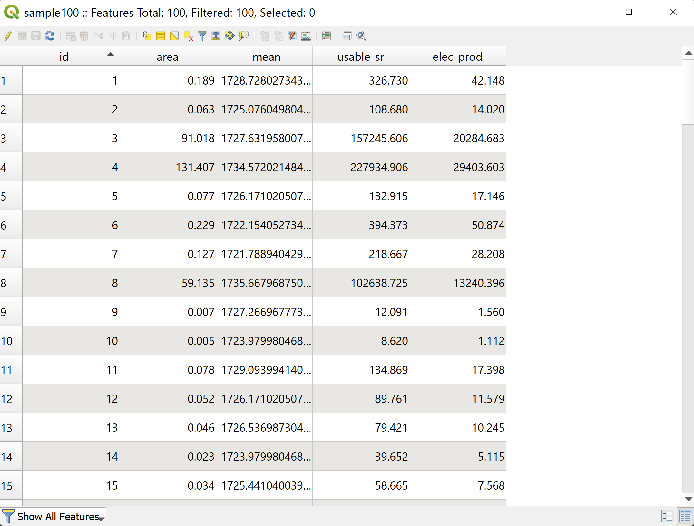
```

As discussed in \@ref(selecting-a-sample-size) we will digitize another sample for La Plata following the same steps as in \@ref(digitizing-a-sample-with-qms) and \@ref(including-the-density-factor), this time with 300 random points. 

## Spatial stratified sampling with QGIS

If we look at the following map, we can see that the city has areas with more built up land than others. 

```{r stratified allocation sampling, fig.align='center', warning=FALSE, echo=FALSE, fig.cap="Satellite Imagery of La Plata provided by ESRI"}
laplata_poly <- read_sf("data/polygon_3.shp")
laplata_poly <- st_transform(laplata_poly, "+proj=merc +lon_0=0 +k=1 +x_0=0 +y_0=0 +ellps=WGS84 +datum=WGS84 +units=m +no_defs")
mapview(laplata_poly,  map.types =  "Esri.WorldImagery", alpha.regions = 0, color="red", lwd=2, legend=F)
```

The most suitable stratification in this case, where we have no knowledge about neighborhoods in the city or other significant characteristics of the city would be to use a spatial characteristic and divide La Plata into strata by land use and land cover. Therefore we will create strata according to built up and non built up areas based on satellite imagery provided by the [Copernicus Land Monitoring Service global maps of land cover & cover changes and related surface area statistics](https://lcviewer.vito.be/about) in QGIS.

### Land use change raster

To download the land use raster go to the following link -  https://lcviewer.vito.be/2015 and select the download option to choose the area of analysis. (*See \@ref(fig:img-213)*) 

```{r img-213, out.width='100%', fig.align='center', echo=FALSE, fig.cap="Land Use Map by Copernicus Land Monitoring Service"}
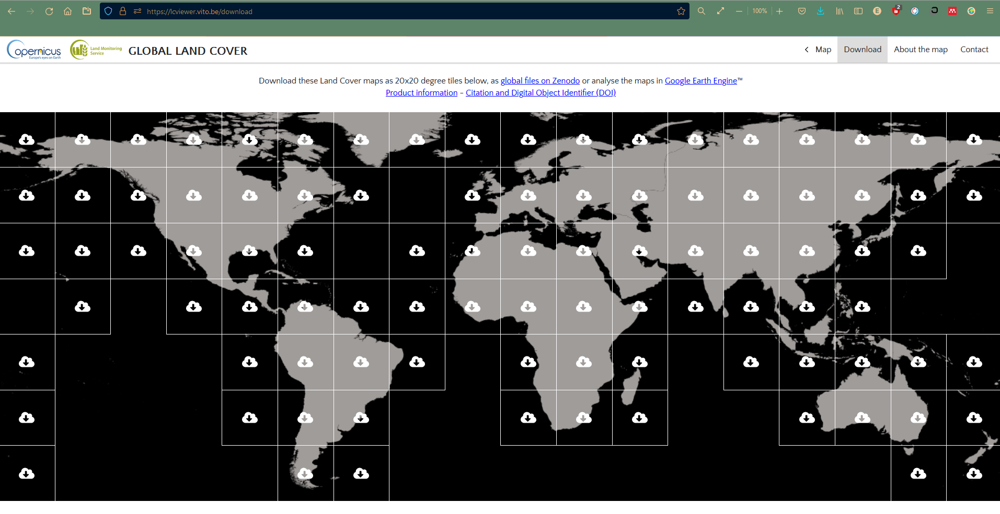
```

Next, we will upload the land use and land cover raster layer to QGIS, similar to the steps in \@ref(adding-raster-layers-to-qgis). (*See \@ref(fig:img-214)*)

```{r img-214, out.width='100%', fig.align='center', echo=FALSE, fig.cap="La Plata Land Use and Land Cover in QGIS"}
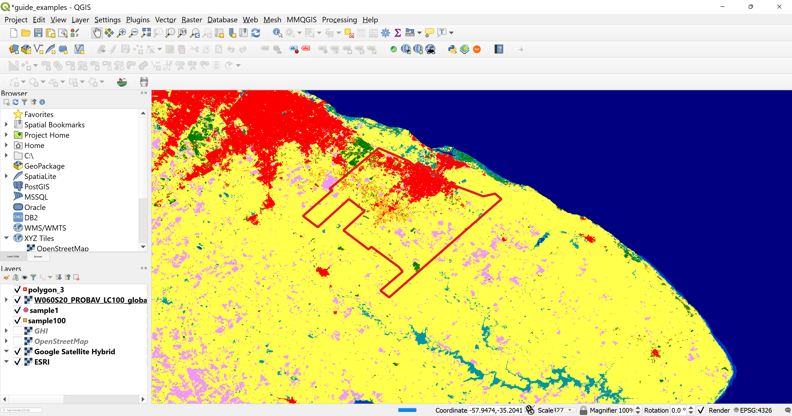
```

Then we would like to keep only the part of the raster that falls under the administrative border of La Plata. This can be done by going to **Raster menu**, selecting the **Extraction** option, and clicking on **Clip Raster by Mask Layer...**. (*See \@ref(fig:img-215)*)

```{r img-215, out.width='70%', fig.align='center', echo=FALSE, fig.cap="Clip Raster by Mask Layer Dialog"}
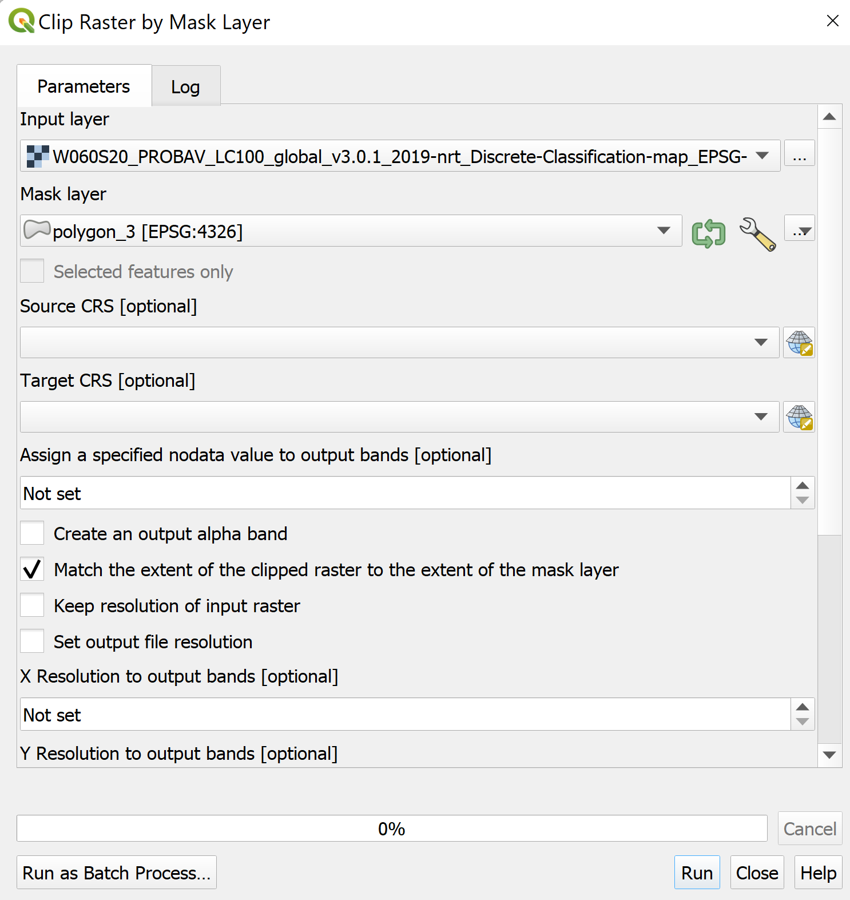
```

The dialog window will open, in it we can enter our **Input layer** the raster to be clipped, the **Mask layer** which is <span style="color: blue;">polygon_3</span>, and save the new raster as <span style="color: blue;">laplata_landuse</span>. (*See \@ref(fig:img-216)*)

```{r img-216, out.width='100%', fig.align='center', echo=FALSE, fig.cap="Clip Raster by Mask Layer Output"}
knitr::include_graphics("images/clip.png")
```

According to the Copernicus Land Monitoring Service global maps of land cover & cover changes and related surface area statistics web browser, the pixel values that are between 50-60 are defined as built up area.
We will reclassify the raster image so the pixels between 50-60 will be given the value 1 and all the other pixels 0. 

In the **Processing Toolbox** search bar we can search for the tool we would like to use - **Reclassify by table**. Then the algorithm configuration window will open and we can choose our raster layer <span style="color: blue;">laplata_landuse</span> and the click on the **Reclassification table** parameter. (*See \@ref(fig:img-217)*)

```{r img-217, out.width='100%', fig.align='center', echo=FALSE, fig.cap="Reclassify by Table"}
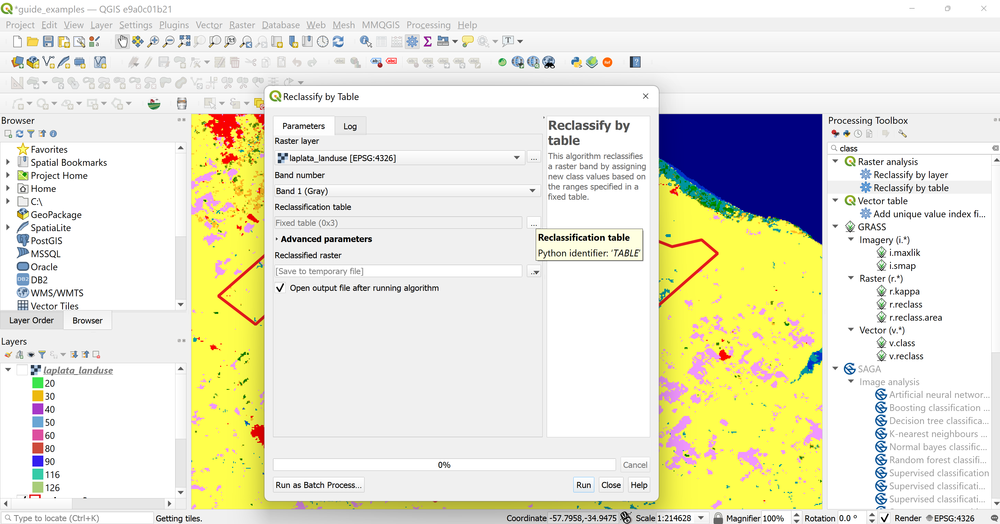
```

In the **Reclassification table** we will set the values as seen in figure *\@ref(fig:img-218)* and after we press OK we check the **Advanced parameters** and make sure that the **Range boundaries** are correct. (*See \@ref(fig:img-219)*)

```{r img-218, out.width='70%', fig.align='center', echo=FALSE, fig.cap="Reclassification Table"}
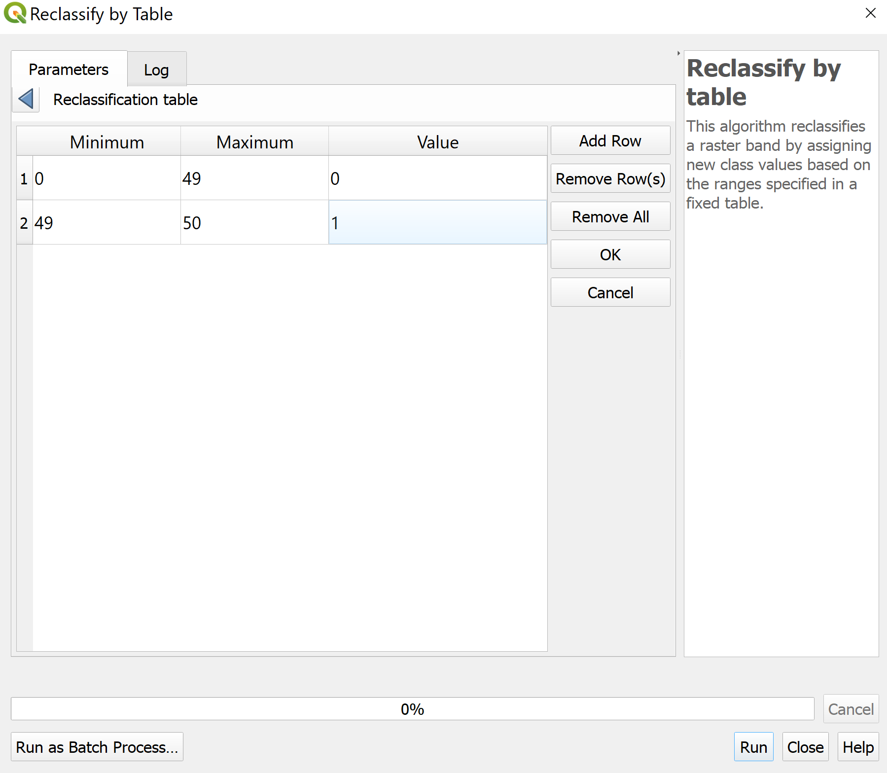
```
```{r img-219, out.width='70%', fig.align='center', echo=FALSE, fig.cap="Advanced Parameters"}
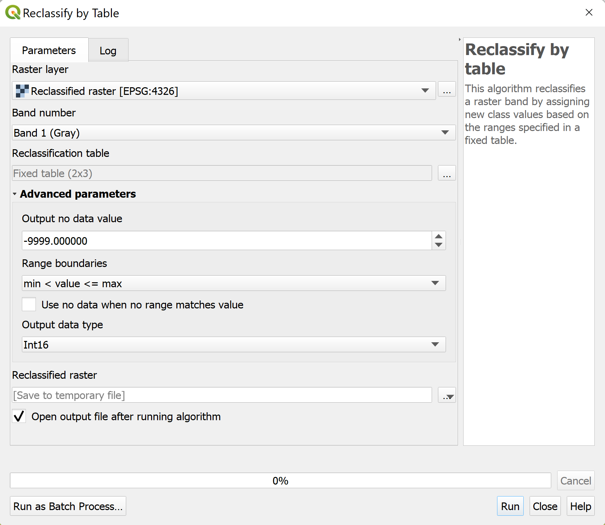
```

As a final step we will go to the **Symbology** of the <span style="color: blue;">laplata_landuse</span> layer and change the **Max** value to 1.
Then we can see clearly which part of the city is built up and which is not. (*See \@ref(fig:img-220)*)

```{r img-220, out.width='100%', fig.align='center', echo=FALSE, fig.cap="La Plata - Built Up and Non Built Up Area Classification"}
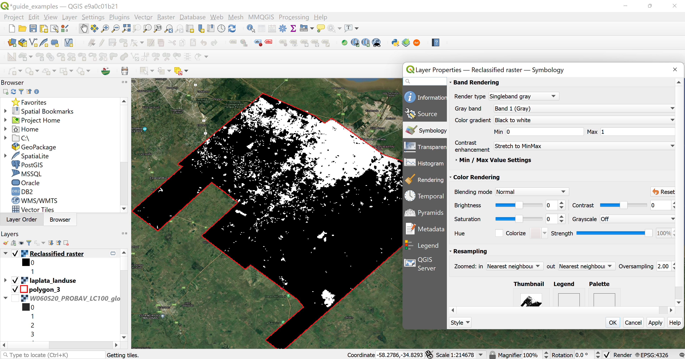
```

### Raster to polygons 

To compute spatial random points for each strata, we need to convert the reclassified raster to two vector layers - one for the built up area and another for the non built up area. For this process, we will use the **Raster Conversion** algorithm **Polygonize (Raster to Vector)...**. (*See \@ref(fig:img-221)*)

```{r img-221, out.width='100%', fig.align='center', echo=FALSE, fig.cap="Polygonize (Raster to Vector)"}
knitr::include_graphics("images/rastovec.png")
```

The **Polygonize (Raster to Vector)...** window dialog will open and we will put the Reclassified raster layer as the input layer. (*See \@ref(fig:img-222)*)  
The out put can be seen in figure *\@ref(fig:img-223)*.  

```{r img-222, out.width='70%', fig.align='center', echo=FALSE, fig.cap="Polygonize (Raster to Vector) Dialog"}
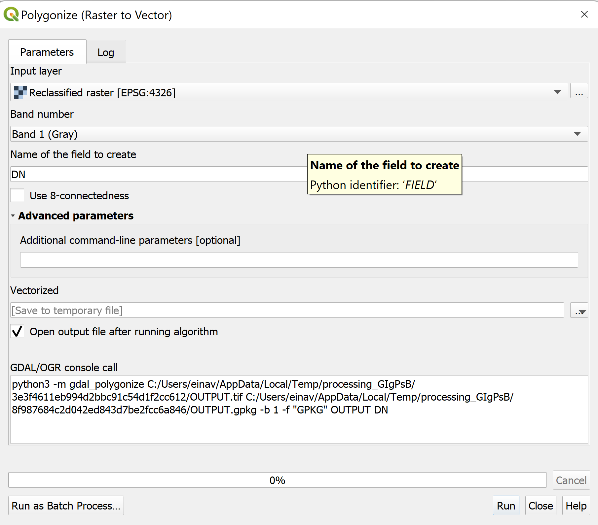
```
```{r img-223, out.width='100%', fig.align='center', echo=FALSE, fig.cap="Polygonize (Raster to Vector) Output"}
knitr::include_graphics("images/rastovec2.png")
```

Next, we will open the Vectorized layer's attribute table and click on the **Select features using an expression...** option. (*See \@ref(fig:img-224)*) 
When the dialog window will open we will create an expression to first select all the **DN** values that belong to the non built up area. (*See \@ref(fig:img-225)*) 
Then we can right click on the Vectorized layer, select **Export**, **Save Selected Features As...** and save the non built up area as a vector layer in our directory. (*See \@ref(fig:img-226)*) 

```{r img-224, out.width='70%', fig.align='center', echo=FALSE, fig.cap="Vectorized Layer Attribute Table"}
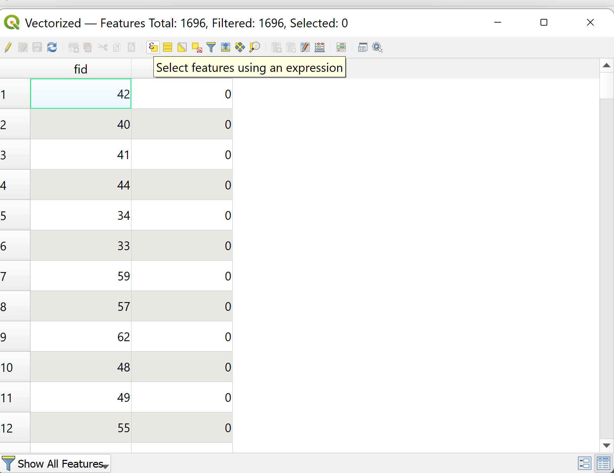
```
```{r img-225, out.width='70%', fig.align='center', echo=FALSE, fig.cap="Select Features Using An Expression"}
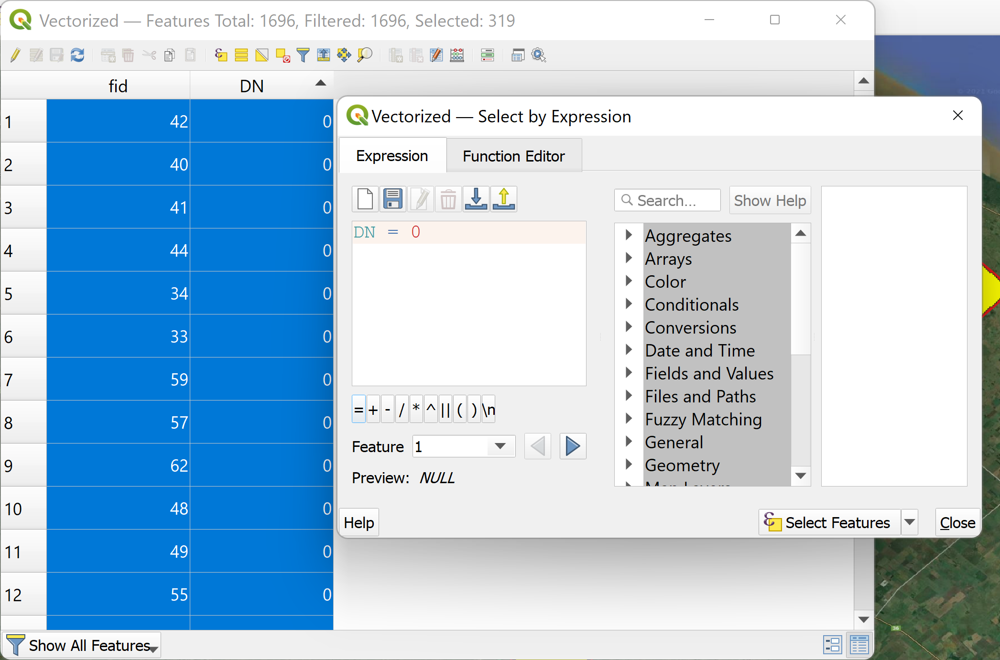
```
```{r img-226, out.width='100%', fig.align='center', echo=FALSE, fig.cap="Select Features Using An Expression"}
knitr::include_graphics("images/rastovec5.png")
```

Then repeat the process for the built up area. The result vector layers can be seen in figure *\@ref(fig:img-227)* with the purple layer indicating the non built up area and the pink the built up area.

```{r img-227, out.width='100%', fig.align='center', echo=FALSE, fig.cap="Built Up and Non Built Up area Vector Layers"}
knitr::include_graphics("images/rastovec6.png")
```

Now that we have two strata, we will once again compute spatial random points as described in section \@ref(spatial-random-sampling-with-qgis), and then digitize them according to sections \@ref(digitizing-a-sample-with-qms) and \@ref(including-the-density-factor). 

## RStudio calculations 

To calculate the estimation of the total renewable electricity potential in La Plata we will use RStudio. If you have no prior experience with R or RStudio it is recommended to follow this [Getting Started with Data in R tutorial](https://moderndive.com/1-getting-started.html). 

The methodology, calculations and equations in this section are based on the book **Sampling by Steven K. Thompson** published in 2012. (See \@ref(references))

**The full calculations for this section can be found [here](https://bookdown.org/einavg7/laplata_sampling/laplata_sampling.html)**

First, we will open a new R Script, install the required packages for this analysis and set our work directory:

```{r setup, eval=FALSE, warning=FALSE, echo=TRUE}
#install packages
install.packages("dplyr")
install.packages("sf")

#load pacakges
library(dplyr)
library(sf)

#set work directory
setwd(".../La Plata/data")
```
### Random sampling

To start with our random sampling computations we will read the sample100.shp from our directory to RStudio with the ```read_sf``` function and set its CRS with the ```st_transform``` function. Both functions are from the [**Simple Features for R (sf)** library](https://r-spatial.github.io/sf/).

```{r random sampling, warning=FALSE}
sample1 <- read_sf("data/sample100.shp")
sample1 <- st_transform(sample1, "+proj=merc +lon_0=0 +k=1 +x_0=0 +y_0=0 +ellps=WGS84 +datum=WGS84 +units=m +no_defs")
```

Next, we will assign all the building rooftops with an area of 30 and under, the value 0 to include our density factor. In addition, we will create a column with megawatt per hour (mWh) so the results will be easier to read.  

```{r random sampling2, warning=FALSE}
#change to 0 above and equal 30 sqm
sample1$elec_prod[sample1$area <= 30] <- 0
#create mega watt per hour (mWh) column
sample1$elec_prod_mwh <- sample1$elec_prod/1000

head(sample1)
summary(sample1)
```

To start with the estimation we will need to compute the primary parameters of the sample.
The following steps show what functions or equations are used to calculate the parameters in RStudio. Most of the functions used are from base R and their descriptions can be found [here](https://stat.ethz.ch/R-manual/R-devel/library/base/html/00Index.html).

First, we calculate the sample mean $\overline{y}$ and the sample variance $s$.

```{r sample 1 c, warning=FALSE}
n1 <- as.numeric(nrow(sample1))
y1 <- mean(sample1$elec_prod_mwh)
paste("The mean of sample 1: ", round(y1,2), "(mWh)")
N_all <- 2482 #all buildings in the city
s1 <- var(sample1$elec_prod_mwh)
paste("The variance of sample 1: ", round(s1,2), "(mWh)")
```

The following equation calculates the unbiased variance of the estimator $\overline{y}$:

\begin{equation} 
  \hat{var}(\overline{y})= (\frac{N-n}{N})(\frac{s^2}{n}) (\#eq:unvar)
\end{equation} 

* $N$ is the total population size -> the number of all the buildings in La Plata (2,482).^[DATA FROM 2019, CONTRIBUTED BY JULIETA FREDIANI FROM THE INSTITUTE OF RESEARCH AND POLICIES OF THE BUILT ENVIRONMENT - FACULTY OF ARCHITECTURE AND URBANISM - NATIONAL UNIVERSITY OF LA PLATA.] 
* $n$ is the sample size -> 100. 
* $s^2$ is the sample variance. 

The following equation calculates the estimated standard error of the estimator $\overline{y}$: 

\begin{equation} 
  SEM = \sqrt{\hat{var}(\overline{y})} (\#eq:se)
\end{equation} 

```{r variance, warning=FALSE}
var_un1 <- ((N_all-n1)/N_all)*(s1/n1)
paste("The variance of the sample mean: ", round(var_un1,2) , "(mWh)")

ese1 = sqrt(var_un1) #estimated standard error of variance
paste("The estimated standard error of the sample mean: ", round(ese1,2), "(mWh)")
```

The following equation calculates an unbiased estimator of the population total $\hat{t}$: 
\begin{equation} 
  \hat{t} = N{\overline{y}} (\#eq:t)
\end{equation} 

The following equation calculates the unbiased variance of the estimator $\hat{t}$: 

\begin{equation} 
  \hat{var}(\hat{t})= N^2\hat{var}(\overline{y}) (\#eq:tv)
\end{equation} 

The following equation calculates the estimated standard error of the estimator $\hat{t}$: 
\begin{equation} 
  SEM = \sqrt{\hat{var}(\hat{t})} (\#eq:set)
\end{equation} 

```{r total, warning=FALSE}
t_un1 = N_all*y1 
paste("The estimation of the renewable electricity production potential by all the buildings in the city:", round(t_un1,2), "(mWh)")

t_var_un1 = (N_all^2) * var_un1 #unbiased variance with the estimate of the total
paste("The variance of the estimated total:", round(t_var_un1,2), "(mWh)")

ese_t1 = sqrt(t_var_un1) #estimated standard error of total
paste("The estimated standard error of the total:", round(ese_t1,2), "(mWh)")
```

The following code calculates a 95% confidence interval for the sample.

```{r CI 1, warning=FALSE}
#confidence interval with 95% 
CI1 <- t_un1 + qt(c(0.05,0.95), df=99) * ese_t1
paste("The 95% confidence interval estimation for sample 1 is: ", "(",round(CI1[1],2)," (mWh), ",round(CI1[2],2)," (mwh))", sep = "")
```

We repeat these calculations for the sample with 300 building rooftops and both samples combined.

### Equal size stratification 

For the equal size strata, we have 60 building rooftops sampled for the built up area and non built up area. We combine the two strata to one ```sf``` object using the ```rbind``` function and compute the same calculations as in \@ref(random-sampling).

```{r strat, warning=FALSE, eval=FALSE, echo=TRUE}
bu <- read_sf("strata_bu.shp")
bu <- st_transform(bu, "+proj=merc +lon_0=0 +k=1 +x_0=0 +y_0=0 +ellps=WGS84 +datum=WGS84 +units=m +no_defs")
#add a landuse column to differ between strata when combined
bu$landuse <- "Built up"
nonbu <- read_sf("strata_nonbu.shp")
nonbu <- st_transform(nonbu, "+proj=merc +lon_0=0 +k=1 +x_0=0 +y_0=0 +ellps=WGS84 +datum=WGS84 +units=m +no_defs")
nonbu$landuse <- "Non built up"

#combine strata and change to 0 above and equal 30 sqm
strat <- rbind(bu, nonbu)
strat$elec_prod[strat$area <= 30] <- 0
strat$elec_prod_mwh <- strat$elec_prod/1000
```

### Optimal allocation stratification

The sample calculations from the built up area present more variable strata. To achieve a better estimation we would like to divide the city into strata using an optimal allocation design. The optimum scheme allocates a larger sample size to the more variable strata and a smaller sample size to the more difficult-to-sample strata. 

Therefore, we will follow section \@ref(spatial-random-sampling-with-qgis) and compute more spatial random points in the built up strata and less in the non built up strata. 

After, we will add again the optimally allocated strata to RStudio and calculate the parameters for this sample, as described in \@ref(random-sampling) and \@ref(equal-size-stratification).

In this analysis for the built up strata 95 building rooftops were sampled, and for the non built up strata 5. 

## Comparison between sample results and sampling methods

Figure \@ref(fig:img-228) presents the results of the different samples collected for the city of La Plata.

The most important parameters when comparing between sampling results are the $SEM$ / $SET$ and the confidence interval range.

```{r img-228, out.width='100%', fig.align='center', echo=FALSE, fig.cap="Summarizing Table of Sampling Results"}
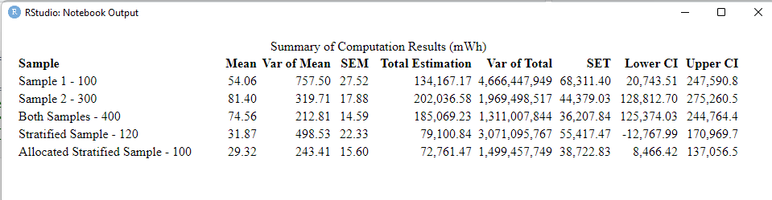
```

In our results, we can see that the sample of 400 building rooftops had the lowest standard error estimation and a more narrow confidence interval range than the other samples. 
This means that the estimation of the total electric potential of this spatial random sample is our best estimate. 

*It is important to acknowledge that the optimal allocation sample also provided a low standard error estimation, this may indicate that if we increase our sample size we can have a better estimation of the total.* 

# Results and outputs

#### Rosario results {-}

The results for the electricity balance of 34 government operated buildings in the city of Rosario are presented in \@ref(fig:img-229), 3 buildings did not have the electricity consumption data. The total annual renewable electricity production potential (for 37 buildings) is 14,921.49 $mWh$, and the total annual electricity consumption is 1,388.016 $mWh$, therefore the annual renewable electricity balance is 12,812.970 $mWh$. 

```{r img-229, out.width='100%', fig.align='center', echo=FALSE, fig.cap="Rosario Renewable Electricity Balance"}
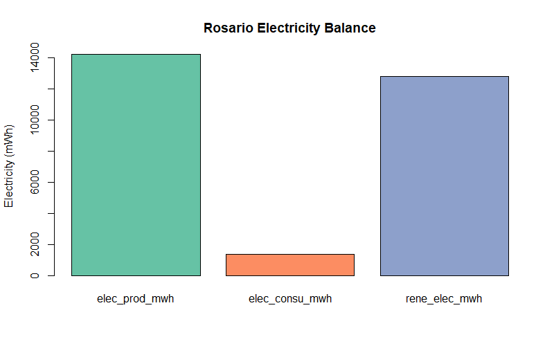
```

The minimum value for the annual electricity production of 37 municipal buildings, is 29.86 $mWh$, the maximum value is 2,224.67 $mWh$ and the mean value is 403.28 $mWh$. The minimum value for annual electricity consumption for 34 buildings, is 3.064 $mWh$, the maximum value is 414.480 $mWh$ and the mean value is 40.824 $mWh$. And, the minimum value of the renewable electricity balance, is -116.1 $mWh$, the maximum value is 1810.2 $mWh$ and the mean value is 376.9 $mWh$.

For all the buildings extracted from OSM in the administrative borders of Rosario, including the government operated buildings but excluding buildings equal to or under 30 $m^2$, a total of 9,783 buildings, the total renewable electricity production potential is 1,449,576 $mWh$.

When estimating renewable electricity potential for the whole city of Rosario, the sampling design that had the best estimate was samples 1 and 2 combined with a total of 400 digitized building rooftops. The sample estimated a total of 9,704,559 $mWh$ renewable electricity production potential with a standard error of 2,441,361 $mWh$, and a 95% confidence interval of 5,679,532 $mWh$, 13,729,586 $mWh$ for Rosario’s 357,126 buildings. Thus, there is a 95% probability that the total renewable electricity production potential for Rosario is between 5,679,532 to 13,729,586 $mWh$. However, sample 2 with 300 digitized building rooftops presented less variation ($s^2$=15,541.21 $mWh$) than both samples combined ($s^2$=18,714.05 $mWh$) and produced the second-best estimate compared to the other samples collected. 

#### La Plata results {-}

The total annual renewable electricity production potential for La Plata's 105 government operated buildings is 35,961.04 $mWh$, where the minimum value is 9.998 $mWh$, the maximum value is 5016.660 $mWh$ and the mean value is 349.136 $mWh$.
For all the buildings extracted from OSM in the administrative borders of La Plata, including government operated buildings but excluding buildings equal to or under 30 $m^2$, a total of 2,657 buildings, the total renewable electricity production potential is 44,6342.8 $mWh$. The distribution of the renewable electricity production potential for the OSM buildings in La Plata- the minimum value is 6.801 $mWh$, the maximum value is 10,541.243 $mWh$ and the mean value is 167.987 $mWh$.

When estimating renewable electricity potential for the whole city of La Plata, the sampling design that had the best estimate was samples 1 and 2 combined with a total of 400 digitized building rooftops, the largest sample collected. The sample estimated a total of 185,069.23 $mWh$ renewable electricity production potential with a standard error of 36,207.84 $mWh$, and a 95% confidence interval of 125,374.03 $mWh$, 244,764.4 $mWh$ for La Plata’s 2,482 buildings. Accordingly, there is a 95% probability that the total renewable electricity production potential for La Plata is between 125,374.03 to 244,764.4 $mWh$. Though, the allocated stratified sample with 100 digitized building rooftops presented less variation ($s^2$=25,362.42 $mWh$) and produced the second-best estimate compared to the other samples collected. This sample estimated a total of 72,761.47 $mWh$ renewable electricity production potential with a standard error of 38,722.83 $mWh$, and a 95% confidence interval of 8,466.42 $mWh$, 137,056.5 $mWh$ for La Plata’s 2,482 buildings. 

The following sections present the **outputs** of the guide. The outputs can be divided to web maps and sampling analysis results.   

#### Web Maps: {-}
The web maps are a result of the steps completed in chapters \@ref(mapping-electricity-consumption) and \@ref(solar-radiation-and-renewable-electricity-calculation). The web maps are hosted on [GitHub Pages](https://pages.github.com/).

[Rosario](https://einavg7.github.io/Rosario_Solar_Potential/) web map  
[La Plata](https://einavg7.github.io/LaPlata_Solar_Potential/) web map  

#### Sampling Analysis: {-}
The sampling analysis is a result of the steps completed in chapter \@ref(renewable-electricity-estimation-for-the-whole-city). These analyses are hosted on [RStudio Connect](https://www.rstudio.com/products/connect/).

Sampling analysis for [Rosario](https://bookdown.org/einavg7/sampling_ros/sampling_ros.html)  
Sampling analysis for [La Plata](https://bookdown.org/einavg7/laplata_sampling/laplata_sampling.html)

#### Full Analyis Links: {-}
To access the data, QGIS projects, RStudio code, and all other resources used while creating this guide, see the following repository links:  

[Rosario](https://github.com/Einavg7/Rosario_Solar_Potential)  
[La Plata](https://github.com/Einavg7/LaPlata_Solar_Potential)  


# References

1. REN21 (2021), Renewables in Cities 2021 Global Status Report (Paris: REN21 Secretariat).
2. Voivontas, D., Assimacopoulos, D., Mourelatos, A., & Corominas, J. (1998). Evaluation of Renewable Energy potential using a GIS decision support system. Renewable Energy, 13(3), 333-344. doi: 10.1016/s0960-1481(98)00006-8 
3. Uyan, M. (2013).
 GIS-based solar farms site selection using analytic hierarchy process (AHP) in Karapinar region, Konya/Turkey. Renewable And Sustainable Energy Reviews, 28, 11-17. doi: 10.1016/j.rser.2013.07.042 
4. Li, C. (2018). GIS for Urban Energy Analysis. Comprehensive Geographic Information Systems, 187-195. doi: 10.1016/b978-0-12-409548-9.09652-4 
5. Kirby Calvert, J.M. Pearce, W. E. Mabee. Toward renewable energy geo-information infrastructures: Applications of GIScience and remote sensing that build institutional capacity. Renewable and Sustainable Energy Reviews, Elsevier, 2013, 18, pp.416-429. 10.1016/j.rser.2012.10.024. hal-02120459 
6. Resch, B., Sagl, G., Törnros, T., Bachmaier, A., Eggers, J., & Herkel, S. et al. (2014). GIS-Based Planning and Modeling for Renewable Energy: Challenges and Future Research Avenues. ISPRS International Journal Of Geo-Information, 3(2), 662-692. doi: 10.3390/ijgi3020662 
7. Coetzee, S., Ivánová, I., Mitasova, H., & Brovelli, M. (2020). Open Geospatial Software and Data: A Review of the Current State and A Perspective into the Future. ISPRS International Journal Of Geo-Information, 9(2), 90. doi: 10.3390/ijgi9020090 
8. Open Knowledge Foundation. The Open Definition. Retrieved August 2021, from http://opendefinition.org/
9. Homepage - OSGeo. Retrieved August 2021, from https://www.osgeo.org/
10. OpenStreetMap. Retrieved August 2021, from https://www.openstreetmap.org/
11. Welcome to the QGIS project!. Retrieved 25 August 2021, from https://qgis.org/en/site/
12. About NextGIS. Retrieved 2 November 2021, from https://nextgis.com/about/ 
13. Thompson, S. (2012). Sampling. Hoboken, N.J.: Wiley.
14. Wang, J.-F., Stein, A., Gao, B.-B., Ge, Y., A review of spatial
sampling. Spatial Statistics (2012), doi:10.1016/j.spasta.2012.08.001
15. Delmelle, E. (2012). Spatial Sampling. The SAGE Handbook Of Spatial Analysis, 182-206. doi: 10.4135/9780857020130.n10
16. Israel, G.D. (1992) Determining Sample Size. University of Florida Cooperative Extension Service, Institute of Food and Agriculture Sciences, EDIS, Florida. 
